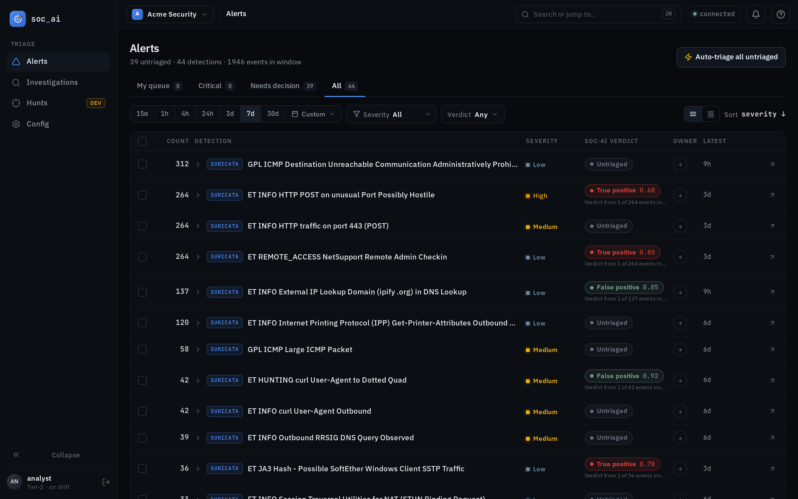
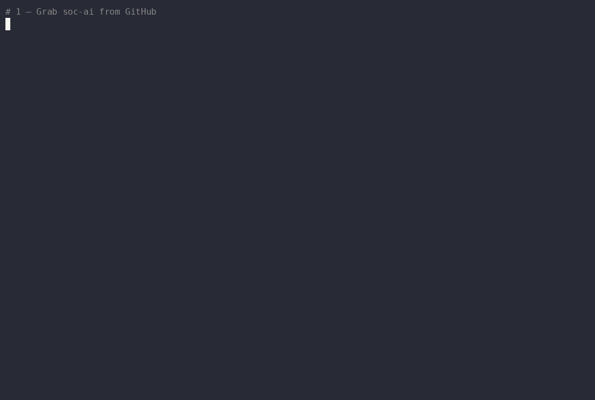

<div align="center">


<p>
  
  
  
  
</p>

</div>

soc-ai reads the alerts on your [Security Onion](https://securityonionsolutions.com/) grid and triages them with an LLM you host yourself. For each alert it pulls the related events, checks what else the host has been doing, runs the indicators against local threat intel, and decodes the packets off the sensor when that's what it takes. Then it hands you a verdict, a confidence number, and the reasoning that got it there.

The model runs on your own hardware behind a [LiteLLM](https://docs.litellm.ai/) gateway. Nothing about your network leaves it, and write-backs stay yours: the agent recommends, you execute — the one exception is an audited auto-acknowledge for high-confidence, low-stakes false positives, on by default and one toggle to turn off. There's an optional cloud "Oracle" for a second opinion on the hard ones; it's off until you turn it on, and its input is sanitized first.

<div align="center">
  
</div>

> Not affiliated with or endorsed by Security Onion Solutions, LLC. soc-ai is a separate service that talks to a grid you already run.

## The web console

soc-ai runs a **web console** at `/app`: your alert queue grouped by rule, with the AI verdict and confidence inline next to each one. Open an alert to investigate it, or sweep the whole untriaged queue with auto-triage. Every investigation gets a shareable permalink.

<div align="center">
  
</div>

Under the hood, for one alert the agent will:

- read the alert context, the related events (via OQL), and the host's recent alert history;
- enrich the indicators against on-disk threat intel: blocklists, GeoIP/ASN, cloud-prefix tagging;
- pull and decode raw PCAP from the sensor when the payload matters;
- weigh the evidence and write a verdict with its confidence and rationale;
- recommend the write actions (acknowledge, escalate to a case, comment) for you to run with one click.

## Hunt across the estate, not just one alert

Some questions are bigger than a single detection: *"is anything beaconing to a rare external IP?"*, *"are the DCs seeing credential-abuse lockouts?"*, *"APT-X uses technique Y — is it showing up here?"* The **Hunt Console** takes an objective in plain English and turns the same read-only agent loose across many hosts and a time window, then hands back **findings + a narrative** mapped to MITRE ATT&CK, rather than a single-alert verdict.

<div align="center">
  
</div>

Hunts follow the **same safety model** as investigation: strictly read-only. The agent queries and correlates; it never acks, escalates, or edits a case. It runs on a bounded budget and concludes with what it found, and if it's cut short it still writes up a grounded partial report rather than erroring out. Kick one off ad hoc from the Hunt Console, from an alert group, or on a schedule.

## What it won't do on its own

The whole point is that you stay in control of anything that changes state.

- **Reads run freely:** pulling events, context, enrichment, and packets is safe, so the agent does it without asking.
- **Writes wait for a human:** acknowledging an alert, opening a case, leaving a comment — the agent recommends them and you execute them with a click. One pragmatic carve-out ships on by default: **confident false positives are auto-acknowledged** (confidence-gated, never on critical/high-severity or malware/exploit-class alerts, every unattended write audited). `auto_ack_fp_enabled=false` turns it off.
- **Nothing leaves your network without your consent.** The reasoning runs on your own model, on your own hardware. The Oracle (an optional cloud second opinion) is **off by default**, and even when you turn it on, internal hostnames, usernames, and IPs are redacted before anything is sent. Leave it off and the whole pipeline stays on your network.

More detail in [docs/SAFETY_MODEL.md](docs/SAFETY_MODEL.md).

## Why run your own

Alert triage is the one place a SOC most wants to point an LLM, and the one place
you least want to ship your network's hostnames, usernames, and IPs to someone
else's cloud. soc-ai exists so you don't have to make that trade:

- **Free and yours:** no per-seat, per-alert, or per-investigation meter, and no
  license unlocked by phoning home. You run it, you own it.
- **Fully local, or air-gapped:** the reasoning runs on a model you host. With the
  Oracle off (the default), nothing about your network leaves it; the whole
  pipeline works with no internet at all.
- **Readable reasoning:** every verdict cites the events it rests on, and no
  true/false-positive call stands without evidence from a tool call. The logic is
  in the open. Read exactly how a verdict was reached, and change it.
- **You own every change:** the agent recommends writes and you execute them; the
  one unattended write — the FP auto-ack — is bounded, audited, and yours to
  switch off.

If you already run Security Onion, soc-ai is the self-hosted way to put a local
model to work on your queue.

## Quickstart

You'll need a Linux host with `git` and `curl`, network reach to your SO grid, and a LiteLLM gateway serving at least one model. `setup.sh` handles Docker for you, including the automatic install on RHEL / Rocky / Alma 10. **First-time installers: skim [the Security Onion account + firewall prerequisites](docs/SECURITY-ONION-SETUP.md) first.** Pinholing soc-ai's IP through SO's firewall and the audit-log role grant are the two things that reliably bite.

`git` and `curl` aren't preinstalled on minimal images, so add them first:

```bash
# RHEL / Rocky / Alma / Fedora
sudo dnf install -y git curl
# Debian / Ubuntu
sudo apt install -y git curl
```

```bash
git clone https://github.com/nuk3s/soc-ai.git && cd soc-ai
./setup.sh
```

`setup.sh` walks you through the connection settings and checks them *before* it builds anything (a wrong password or an unreachable gateway fails in seconds, not after a three-minute build), lets you pick your model from the gateway's live list (it authenticates to fetch it), generates the secrets and a TLS cert, brings the stack up, and prints the URL and admin password:

<div align="center">
  
</div>

> Replay it in your terminal: `asciinema play docs/demo/install-walkthrough.cast`. To stand up more hosts without the prompts, fill in `setup.conf` once and run `./setup.sh --auto`.

### Then work an alert in the browser

Open `https://<host>:8443/app`, accept the self-signed cert, and sign in as `admin`. Pick a detection, hit **Investigate**, and watch the agent work live: it pulls the alert and its Zeek/PCAP context, enriches the indicators, and lands an evidence-cited verdict. The write-backs it recommends are yours to execute with a click:

<div align="center">
  
</div>

> _Shown with an example detection on synthetic data; your grid's real alerts appear the same way._

Full Docker options — required mounts, SELinux relabeling, upstream TLS trust (`*_VERIFY_SSL`), the port-8443-vs-SO-nginx conflict, the manual + rsync/systemd paths — are in **[docs/DOCKER.md](docs/DOCKER.md)**; the SO account, role, and firewall setup is in **[docs/SECURITY-ONION-SETUP.md](docs/SECURITY-ONION-SETUP.md)**.

## How it works

<div align="center">
  
</div>

`ANALYST_MODEL` is the one model the agent triages with: whatever your gateway serves (model IDs drift, so re-probe `/v1/models`). The reasoning happens locally. The Oracle path is the only way anything reaches a cloud API, it's opt-in, and it only ever sees sanitized input.

## Documentation

📖 **Full docs site: [nuk3s.github.io/soc-ai](https://nuk3s.github.io/soc-ai/)**. The same
docs as below, searchable, with dark mode. Build it locally with `uv run --group docs mkdocs serve`.

- [docs/WEBUI_GUIDE.md](docs/WEBUI_GUIDE.md): the console (triage, auto-triage, investigations, the admin config page)
- [docs/AGENT_TOOLS.md](docs/AGENT_TOOLS.md): every tool the agent can call, and the guardrails on them
- [docs/ARCHITECTURE.md](docs/ARCHITECTURE.md): how the pieces fit together
- [docs/OQL_PRIMER.md](docs/OQL_PRIMER.md): the query language the agent searches with
- [docs/SAFETY_MODEL.md](docs/SAFETY_MODEL.md): the write-action flow, the audit schema, and redaction (Oracle + cloud analyst models)
- [docs/DOCKER.md](docs/DOCKER.md) · [docs/DEPLOYMENT.md](docs/DEPLOYMENT.md): installing it
- [CHANGELOG.md](CHANGELOG.md) · [CONTRIBUTING.md](.github/CONTRIBUTING.md) · [SECURITY.md](.github/SECURITY.md)

## Building on it

```bash
uv sync                                 # Python deps + dev tools
uv run pytest --ignore=tests/browser    # the test suite
uv run mypy soc_ai                       # strict type check

cd frontend && npm ci && npm run build   # the React console
```

## Where it's headed

1.0 shipped the triage engine and the always-on console. The 1.0.x line added the **Hunt Console** (estate-wide, objective-driven hunting — now with visual summaries and honest visibility-gap reporting), a **backtest harness** that replays the agent against your own already-dispositioned alerts so you can measure agreement before you trust it, live model selection from the gateway, context-window budgeting, and an opt-in **cloud-egress redaction tunnel** for teams that point the analyst model at a hosted provider. Next up: RAG-backed runbook lookup and wider enrichment coverage. Progress and proposals live in the issue tracker.

## License

Apache 2.0. See [LICENSE](LICENSE).
