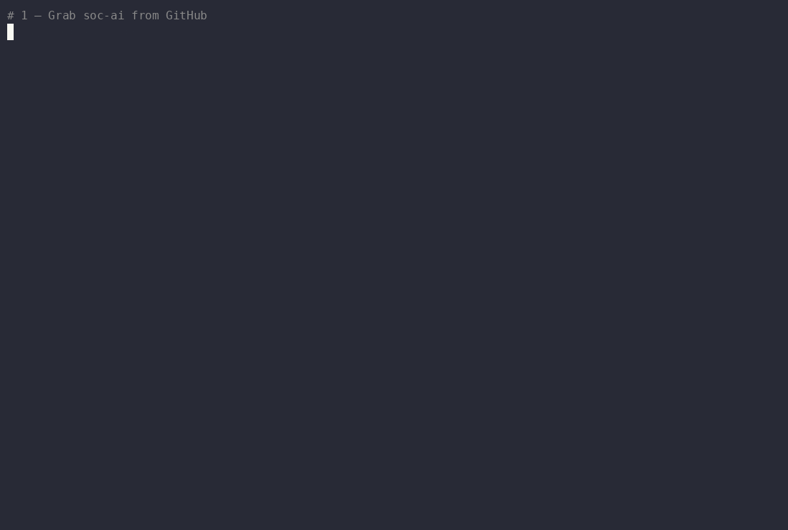

<div align="center">


<p>
  
  
  
  
  <a href="https://soc-ai-demo.onrender.com/"></a>
</p>

### [Try the live demo](https://soc-ai-demo.onrender.com/)

Open recorded investigations, hunts and a backtest in the real console. The demo needs no install and no login. No data leaves the box.

You can also run the same demo on your own host in 5 minutes. It needs no Security Onion grid and no model. Run `docker compose -f docker-compose.demo.yml up --build`, then open `http://127.0.0.1:8080`.

</div>

soc-ai reads the alerts on your [Security Onion](https://securityonionsolutions.com/) grid. It triages them with a large language model that you host yourself. For each alert it pulls the related events, and it checks what else the host has done. It runs the indicators against local threat intel. It decodes the packets from the sensor if the payload matters. Then it gives you a verdict, a confidence number and the reasoning behind them.

The model runs on your own hardware behind a [LiteLLM](https://docs.litellm.ai/) gateway. No data about your network leaves it. The write-backs stay yours, because the agent recommends and you execute. One exception exists. soc-ai can auto-acknowledge a high-confidence, low-stakes false positive and audit that write. The exception is off by default, and one toggle turns it on.

An optional cloud Oracle gives a second opinion on a hard alert. The Oracle is off until you turn it on. soc-ai sanitizes its input first.

<div align="center">
  
</div>

> Security Onion Solutions, LLC has no affiliation with soc-ai and does not endorse it. soc-ai is a separate service. It reads a grid that you already run.

## What's new in 1.5.0

- Analytics run over the grid on their own. Four shipped query analytics cover DCSync, Kerberoasting, AS-REP roasting and decoy interaction. Each one compiles to a single Elasticsearch query and calls no model.
- A new analytic runs in shadow first. A shadow hit brings its receipts: the matched documents, a 30-day dry run, the baseline, and the overlap with a live analytic. You approve or reject the analytic from its own card.
- Hits on one entity form a lead, and the lead starts its own hunt. A loop picks up each open lead within 60 s and runs the hunt. You decide after the hunt lands.
- A hunt is investigated as a whole. Promotion reads the objective, every finding and every cited document, up to 40, and ends in a verdict with citations.
- A lead names the open leads that relate to it, by analytic, alert rule, external network or ATT&CK technique, over the last 7 days.
- The Needs-you strip counts the two things that wait on you: unread shadow hits, and leads that need a decision.
- Verdicts got more accurate. On 11 attack-range alerts with known truth, the investigation loop landed 31 of 31 correct verdicts against 29 of 31 before the release.
- Writes to a Security Onion 3.3 grid work again. soc-ai logs in with the Kratos browser flow, and `so_login_flow` pins the flow if you need to.
- `soc-ai leads --report` prints what the lead rule produced per week, so you move a threshold on measurement.

Read the [1.5.0 release notes](docs/releases/1.5.0.md) and the [hunting guide](docs/HUNTING.md).

## The web console

soc-ai runs a web console at `/app`. The console groups your alert queue by rule. Each row carries the verdict and the confidence. Open an alert to investigate it. Use auto-triage to sweep the whole untriaged queue. Every investigation has a permalink that you can share.

<div align="center">
  
</div>

For one alert the agent does this:

1. It reads the alert context, the related events and the recent alert history of the host. It queries the events with OQL.
2. It enriches the indicators against on-disk threat intel: blocklists, GeoIP and ASN data, and cloud-prefix tagging.
3. It pulls and decodes raw PCAP from the sensor if the payload matters.
4. It weighs the evidence and writes a verdict with a confidence and a rationale.
5. It recommends the write actions for you to run with one click: acknowledge, escalate to a case, and comment.

## Hunting across the network

Some questions cover more than one detection. *"Is anything beaconing to a rare external IP?"* *"Are the domain controllers seeing credential-abuse lockouts?"* *"APT-X uses technique Y. Does it appear here?"* The **Hunt Console** takes an objective in plain English. It runs the same read-only agent across many hosts and a time window. It returns findings and a narrative mapped to MITRE ATT&CK.

<div align="center">
  
</div>

A hunt follows the same safety model as an investigation. A hunt is read-only. The agent queries and correlates. It never acknowledges an alert, escalates one, or edits a case. It runs on a bounded budget and reports what it found. If the budget stops it early, it still writes a grounded partial report instead of an error.

Start a hunt from the Hunt Console, from an alert group, or on a schedule.

## Hunting that starts without you

soc-ai also hunts when nobody asks. Five nouns carry that pipeline. The chart below shows all five.

<div align="center">
  
</div>

- **Analytic:** one detection logic. A shipped analytic is a YAML file. A local analytic is one that you write in the app. Both use one schema. A local analytic moves through candidate, shadow, live and retired. soc-ai records the spec text before and after each move.
- **Hit:** one thing one analytic found on one entity, with the documents behind it. A live hit counts at once. A shadow hit waits for your read, and it carries receipts.
- **Lead:** the observations on one entity that are worth one decision. A lead forms at a live weight of 0.85 across two or more types, on a finding with no benign baseline, or on one type that repeats. A lead also names the open leads that relate to it.
- **Hunt:** one agent run with an objective. A new lead starts its own hunt, and that hunt reads the lead's own documents before it queries the grid.
- **Investigation:** one agent run that ends in a verdict. Its subject is one alert, or one hunt with every finding and every document those findings cite.

The Needs-you strip at the top of the Hunts page counts what waits on you. `soc-ai leads --report` and the Lead quality block on the Analytics tab print what the lead rule produced per week, so a threshold moves on a week of data. [docs/HUNTING.md](docs/HUNTING.md) is the full guide.

## Runbooks

The agent grounds each verdict in your team's own runbooks. A runbook records what is normal on your network, which hosts are known-benign, and how you triage each class of alert. During an investigation the agent searches the runbooks and cites the best match. The search ranks a rule link first, then a tag, then a keyword. An optional embeddings tier adds semantic search.

The Runbooks page in the console is the authoring space. Write a runbook in markdown, or import your existing `.md` procedures. The importer reads the front-matter `title:`, `tags:` and `rules:` fields leniently. Click **Load starter pack** to seed 10 generic, vendor-neutral SOC runbooks from `runbooks/starter-pack/` in the repo.

The starter pack covers beaconing and command-and-control, scanner false positives, brute force, DNS tunneling, phishing, lateral movement, exfiltration, cryptomining, TLS anomalies, and a rule-tuning method. The pack is idempotent, so it never overwrites a runbook that you wrote. Everything stays on your host.

## What soc-ai does not do on its own

You stay in control of every action that changes state.

- **Reads run freely.** The agent pulls events, context, enrichment and packets without asking. A read changes nothing.
- **Writes wait for a human.** A write acknowledges an alert, opens a case or adds a comment. The agent recommends the write and you execute it with a click. One exception ships off by default: soc-ai can auto-acknowledge a confident false positive. The write needs high confidence. It never runs on a critical or high-severity alert. It never runs on a malware-class or exploit-class alert. soc-ai audits every unattended write. Set `auto_ack_fp_enabled=true` under Config → Triage automation to turn it on.
- **No data leaves your network without your consent.** The reasoning runs on your own model and your own hardware. The Oracle is an optional cloud second opinion, and it is off by default. If you turn it on, soc-ai redacts internal hostnames, usernames and IP addresses before it sends anything. Leave it off and the whole pipeline stays on your network.

For more detail, read [docs/SAFETY_MODEL.md](docs/SAFETY_MODEL.md).

## Why run your own

Alert triage is the task a security operations centre most wants to give to an
LLM. It is also the task where you least want to send your hostnames,
usernames and IP addresses to another company's cloud. soc-ai removes that
trade:

- **Free and yours:** soc-ai has no per-seat meter, no per-alert meter and no
  per-investigation meter. No license needs a call home. You run it and you
  own it.
- **Local or air-gapped:** the reasoning runs on a model that you host. The
  Oracle is off by default, so no data about your network leaves it. The whole
  pipeline works with no internet connection.
- **Readable reasoning:** every verdict cites the events that it rests on. A
  true-positive or false-positive verdict needs one of four things: a
  successful tool call, a rule-grounded benign template, a concrete
  indicator-of-compromise hit, or a cited correlated-pivot record. soc-ai
  rewrites any weaker verdict to `needs_more_info`. The logic is open, so you
  can read how a verdict was reached and then change it.
- **You own every change.** The agent recommends a write and you execute it.
  The false-positive auto-acknowledge is the one unattended write. It is
  bounded and audited, and you can switch it off.

If you already run Security Onion, soc-ai puts a local model to work on your
alert queue.

## Quickstart

The full path is in [docs/quickstart.md](docs/quickstart.md). It covers the 5 minute local demo and the one Security Onion grant that people skip.

You need a Linux host with `git` and `curl`, network reach to your Security Onion grid, and an AI model on one of two routes. The primary route is a local OpenAI-compatible endpoint that you run. The repo can start one for you: [docs/LESSER_MODELS.md](docs/LESSER_MODELS.md). The second route is a cloud API key with redacted egress. `setup.sh` asks which route you want, and it handles Docker for you. It installs Docker automatically on RHEL, Rocky and Alma 10.

Read [the Security Onion account and firewall prerequisites](docs/SECURITY-ONION-SETUP.md) before your first install. Two steps reliably cause trouble. The first is the firewall pinhole for the soc-ai IP address through Security Onion. The second is the audit-log role grant.

A minimal image does not carry `git` and `curl`, so install them first:

```bash
# RHEL / Rocky / Alma / Fedora
sudo dnf install -y git curl
# Debian / Ubuntu
sudo apt install -y git curl
```

```bash
git clone https://github.com/nuk3s/soc-ai.git && cd soc-ai
./setup.sh
```

`setup.sh` builds the image from the Dockerfile in place and starts the stack. The first build takes about 3 min.

> **A prebuilt image is available after the first release.** `./setup.sh --prebuilt` then pulls the image from [GHCR](https://github.com/nuk3s/soc-ai/pkgs/container/soc-ai) instead of building it. That path is faster. Pin a version with `SOC_AI_IMAGE_TAG=<x.y.z>`. No image is published before the first release tag, so `--prebuilt` reports `error from registry: denied`. Run plain `./setup.sh` above to build from source. [Watch the releases page](https://github.com/nuk3s/soc-ai/releases) for the first tag.

`setup.sh` does the following:

1. It asks for the connection settings and checks them before it builds anything.
2. It asks whether you run a local model or a cloud model.
3. It lets you pick your model from the live list on the endpoint.
4. It offers day-1 auto-triage and the runbook starter pack.
5. It generates the secrets and a TLS certificate.
6. It starts the stack and runs the doctor.
7. It prints the URL and the admin password.

<div align="center">
  
</div>

> **If something does not work, run the doctor.** Use `docker exec soc-ai python -m soc_ai doctor`, or `uv run soc-ai doctor` from a source checkout. The doctor checks the config, the local store and its migrations, connectivity at the DNS, TCP and TLS layers, Security Onion, Elasticsearch, the gateway, and the measured fitness of the analyst model. The Elasticsearch check covers the audit-grant privilege and the index-pattern coverage. The doctor prints a pass and fail table with a fix hint on every failing line.

> **One command saves your data.** `soc-ai backup` writes the live store into a portable tar.gz file. The store holds the investigations, the audit history, the runbooks and the config. The backup is safe while the app runs. `soc-ai restore` puts the data back. See [docs/DOCKER.md](docs/DOCKER.md#backup-and-restore).

### Work an alert in the browser

1. Open `https://<host>:8443/app`.
2. Accept the self-signed certificate.
3. Sign in as `admin`.
4. Pick a detection and press **Investigate**.

The agent then works in front of you. It pulls the alert and its Zeek and PCAP context, it enriches the indicators, and it lands a verdict that cites its evidence. You execute each recommended write-back with a click.

<div align="center">
  
</div>

> _The picture shows an example detection on synthetic data. The real alerts on your grid look the same._

[docs/DOCKER.md](docs/DOCKER.md) holds the full Docker options: the required mounts, SELinux relabeling, upstream TLS trust through `*_VERIFY_SSL`, the conflict between port 8443 and the Security Onion nginx, and the manual, rsync and systemd paths. [docs/SECURITY-ONION-SETUP.md](docs/SECURITY-ONION-SETUP.md) holds the Security Onion account, role and firewall setup.

## How it works

<div align="center">
  
</div>

`ANALYST_MODEL` names the one model that the agent triages with. It is whatever model your gateway serves. Model IDs drift, so probe `/v1/models` again to confirm the ID. The reasoning runs on your host. The Oracle path is the only path that reaches a cloud API. You opt in to the Oracle, and it reads sanitized input only.

## Documentation

The full docs site is [nuk3s.github.io/soc-ai](https://nuk3s.github.io/soc-ai/). It holds
the same docs as the list below, with search and a dark mode. Build it on your host with `uv run --group docs mkdocs serve`.

- [docs/WEBUI_GUIDE.md](docs/WEBUI_GUIDE.md): the console. It covers triage, auto-triage, investigations and the admin config page.
- [docs/HUNTING.md](docs/HUNTING.md): the hunting layer. Analytics, hits, leads, hunts, the shadow week, the settings, the CLI and the API routes.
- [docs/AGENT_TOOLS.md](docs/AGENT_TOOLS.md): every tool that the agent can call, and the guardrails on them.
- [docs/ARCHITECTURE.md](docs/ARCHITECTURE.md): how the parts work together.
- [docs/OQL_PRIMER.md](docs/OQL_PRIMER.md): the query language that the agent searches with.
- [docs/SAFETY_MODEL.md](docs/SAFETY_MODEL.md): the write-action flow, the audit schema, and redaction for the Oracle and for a cloud analyst model.
- [docs/DOCKER.md](docs/DOCKER.md) · [docs/DEPLOYMENT.md](docs/DEPLOYMENT.md): how to install soc-ai.
- [docs/LESSER_MODELS.md](docs/LESSER_MODELS.md): how to start a backend, and how to qualify a small or slow model with `model-probe`.
- [docs/ROADMAP.md](docs/ROADMAP.md): the state of the project and the plan for it.
- [docs/releases/1.5.0.md](docs/releases/1.5.0.md): the 1.5.0 release notes, with the measured numbers and the upgrade steps.
- [CHANGELOG.md](CHANGELOG.md) · [CONTRIBUTING.md](CONTRIBUTING.md) · [SECURITY.md](.github/SECURITY.md)

## Building on it

```bash
uv sync                                 # Python deps + dev tools
uv run pytest --ignore=tests/browser    # the test suite
uv run mypy soc_ai                       # strict type check

cd frontend && npm ci && npm run build   # the React console
```

## Where soc-ai is headed

<div align="center">
  
</div>

The project moves quickly and it moves in public. Release 1.0 shipped the triage engine and the always-on console in June 2026. The 1.0.x line added the Hunt Console, backtests, runbooks and grid discovery. Release 1.1 made quality a continuous measurement. Release 1.2 came from 14 findings in a full analyst shift on a live deployment. Two releases then went on the unglamorous half: what soc-ai says if the grid is down, saturated or half-read, and what the first 30 minutes of setup are like.

Release 1.3 made soc-ai a hunting tool. A finding can become a full investigation on its own evidence, so "this looks odd" reaches a verdict with no retyping. Four behavioural analytics sweep the network instead of the alert queue. soc-ai can draft a confirmed true positive into a Sigma rule for you to review and deploy. Release 1.3.2 was an adversarial security audit of that work, and every finding from it is fixed or refuted on the record.

Release 1.4 was the trust release. The evaluation now scores the work the product exists for: a plain-English hunt that produces a finding, promotes it, and reaches a verdict. If that run falls short, the evaluation names the step that broke. A verdict must rest on evidence that soc-ai retrieved. Evidence that the run only gathered is not enough. The cloud second opinion can now check its own claims with read-only tools, behind an outbound boundary that is complete by construction.

soc-ai holds more than the defaults show. These features ship behind a switch that is off by default: semantic runbook search, chat memory, the cloud second opinion and its tool loop, scheduled auto-triage, recurring hunts, catalog sweeps, Sigma drafting, PCAP decode, web search, and online enrichment. Turn one on when you decide your network is ready for it.

**Release 1.5 is hunting that starts without you, and it is the current release.** Every earlier release waited for a person. An alert arrived, or you typed an objective.

One number makes the case. A measurement on 2026-09-04 on the grid that soc-ai is developed against found about 3.4 million documents from the sensors. Of those, 3,940 carried an alert tag. That is about a tenth of one percent, from 2 datasets out of about 70. The grid holds about 19 million more documents that arrived as imports, and most of them came from one Windows event-log import. That count leaves the imports out, because no sensor saw them.

An analyst who works the alert queue works the visible part. A hunt that starts from that queue inherits the same loss. A full credential-abuse chain against a real domain controller produced nothing that anyone could have seen at the time. The rule for it had been enabled for months. A rule engine reads the stream as it arrives, and its cursor had already passed those events. A query has no cursor.

A hunt can now be a document instead of a conversation. The document is YAML that compiles to one query and runs with no model call. That is what makes a hunt cheap enough to leave running.

A finding from that path cannot be invented, because nothing generative is involved. The words come from the spec, and a person writes the spec and reviews it before it ships. A condition that soc-ai has already shown you does not come back. soc-ai can also tell "nothing happened" from "I could not see". Every spec declares the telemetry that it needs, so an absent data source becomes a coverage gap in your findings instead of a quiet all-clear.

A fortnight on a real deployment and an attack range changed two things worth knowing. Every population statistic now counts your own sensors instead of imported captures. The catalog doctrine now reaches triage, so soc-ai cannot close a detection as benign on how often it fires if the catalog says that detection has no benign population.

The release then grew a spine. Every analytic writes an observation into one table, and the observations on one entity form a lead. A lead starts its own hunt within 60 s, and a promoted hunt is investigated as a whole: the objective, every finding, and every document those findings cite. A lead also names the open leads that relate to it, so a coordinated attack across several machines is visible from any one of them. The Hunts page holds the pipeline in order, and the Needs-you strip counts the few things that wait on you.

Release 1.6 answers what 1.5 left open. Related leads become a campaign with one owner and one verdict. The Security Onion login gains an API key path. A hunt-subject investigation gets a group key of its own. The lead thresholds get validated against the quality report, and the hunting layer runs on a production deployment. Further out come a measure of normal, and hunts that trigger themselves. [docs/ROADMAP.md](docs/ROADMAP.md) holds the full story and keeps it honest against what shipped.

## License

Apache 2.0. See [LICENSE](LICENSE).
