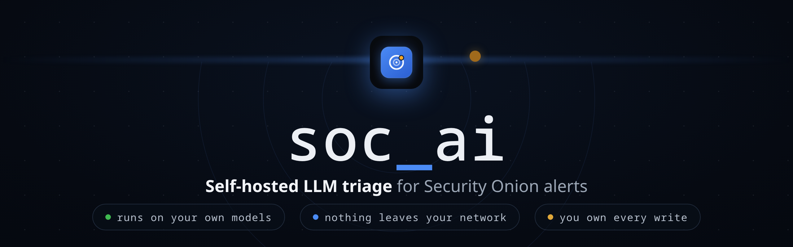
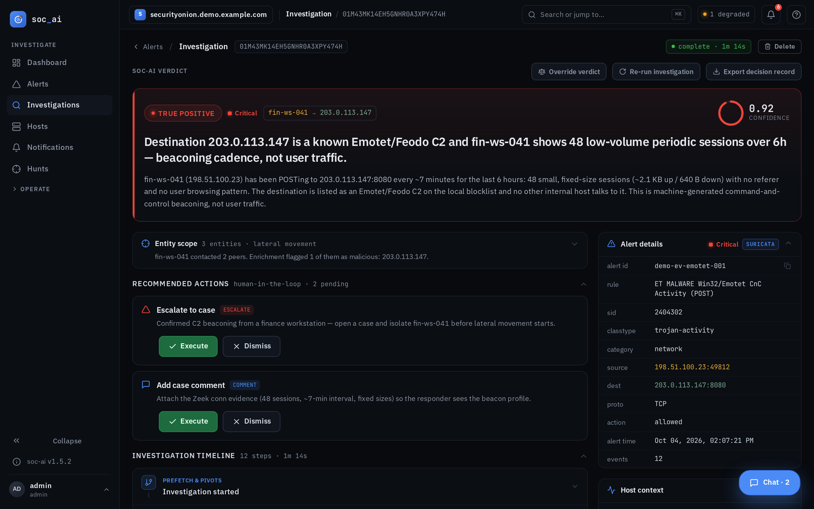
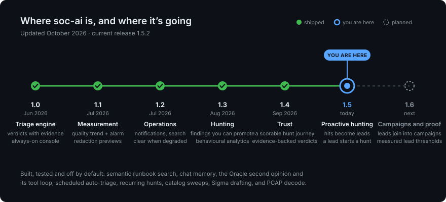

<div align="center">



<p>
  
  
  
  
  <a href="https://soc-ai-demo.onrender.com/"></a>
</p>

[Live demo](https://soc-ai-demo.onrender.com/) · [Docs site](https://nuk3s.github.io/soc-ai/) · [Quickstart](docs/quickstart.md) · [Roadmap](docs/ROADMAP.md)

</div>

soc-ai triages the alerts on your [Security Onion](https://securityonionsolutions.com/) grid with a large language model that you host yourself. For each alert it pulls the related events, checks the indicators against local threat intel and decodes the packets if the payload matters. Then it gives you a verdict, a confidence number and the reasoning behind them.

<div align="center">
  
</div>

> Security Onion Solutions, LLC has no affiliation with soc-ai and does not endorse it. soc-ai is a separate service. It reads a grid that you already run.

## Quick start

Try the [live demo](https://soc-ai-demo.onrender.com/) first. It needs no install and no login. The same demo runs on your own host in 5 minutes. It needs no Security Onion grid and no model.

```bash
docker compose -f docker-compose.demo.yml up --build   # then open http://127.0.0.1:8080
```

A real install needs a Linux host with `git` and `curl`, network reach to your grid, and a model. The model is a local OpenAI-compatible endpoint or a cloud API key with redacted egress.

```bash
git clone https://github.com/nuk3s/soc-ai.git && cd soc-ai
./setup.sh
```

`setup.sh` checks the connection settings, asks which model to use, builds the image and starts the stack. Then it runs the doctor and prints the URL and the admin password. Open `https://<host>:8443/app`, sign in as `admin` and press **Investigate** on a detection.

Read the [Security Onion prerequisites](docs/SECURITY-ONION-SETUP.md) before the first install. People skip two steps there: the firewall pinhole and the audit-log role grant. [docs/quickstart.md](docs/quickstart.md) has the full path from the clone to the first verdict.

## Capabilities

- Triage: the agent reads an alert and its related events, enriches the indicators and decodes the PCAP. It writes a verdict with citations.
- Hunts: you type an objective in plain English, and the read-only agent runs it across many hosts and a time window.
- Analytics and leads: analytics run over the grid on a schedule. Hits on one entity form a lead, and the lead starts its own hunt.
- Runbooks: the agent cites the procedures of your own team. The repo ships a starter pack of 10 runbooks.
- Evidence gates: a true-positive or false-positive verdict needs evidence that the run retrieved. A weaker verdict becomes `needs_more_info`.
- Write-backs: the agent recommends an acknowledge, an escalation or a comment. You run it with one click, and soc-ai audits it.
- Privacy: the model runs on your hardware. The optional cloud Oracle is off by default, and it reads redacted input only.
- Operations: `soc-ai doctor` checks every dependency and names the fix. `soc-ai backup` writes the store into one file.

## Documentation

The [docs site](https://nuk3s.github.io/soc-ai/) holds the same pages, with search.

- Installation: [Quickstart](docs/quickstart.md) · [Security Onion setup](docs/SECURITY-ONION-SETUP.md) · [Docker deployment](docs/DOCKER.md) · [Bare-metal deployment](docs/DEPLOYMENT.md) · [Blocklists](docs/BLOCKLISTS.md) · [Sensor PCAP setup](docs/SENSOR_PCAP_SETUP.md)
- Operation: [Console guide](docs/WEBUI_GUIDE.md) · [Hunting](docs/HUNTING.md) · [Agent tools](docs/AGENT_TOOLS.md) · [OQL primer](docs/OQL_PRIMER.md) · [OQL hunting examples](docs/OQL_HUNT_EXAMPLES.md) · [Test PCAPs](docs/TEST_PCAPS.md)
- Design: [Architecture](docs/ARCHITECTURE.md) · [Safety model](docs/SAFETY_MODEL.md) · [Audit chain breaks](docs/AUDIT-CHAIN.md) · [Lesser models](docs/LESSER_MODELS.md)
- Project: [Roadmap](docs/ROADMAP.md) · Release notes [1.5.2](docs/releases/1.5.2.md), [1.5.1](docs/releases/1.5.1.md) and [1.5.0](docs/releases/1.5.0.md) · [Changelog](CHANGELOG.md) · [Security policy](.github/SECURITY.md)
- Blog: [soc-ai hunts on its own now](docs/blog/2026-10-soc-ai-hunts-on-its-own-now.md) · [Getting an LLM to show its work](docs/blog/2026-07-getting-an-llm-to-show-its-work.md)

## Roadmap

<div align="center">
  
</div>

Release 1.5 is the current release. soc-ai now hunts on its own: analytics run over the grid, and a lead starts its own hunt. Release 1.6 joins related leads into a campaign and validates the lead thresholds. [docs/ROADMAP.md](docs/ROADMAP.md) has the full story, and [CHANGELOG.md](CHANGELOG.md) has every version.

## Contributing

Read [CONTRIBUTING.md](CONTRIBUTING.md). It covers the dev setup, the checks that CI runs and the writing style.

## License

Apache 2.0. See [LICENSE](LICENSE).
