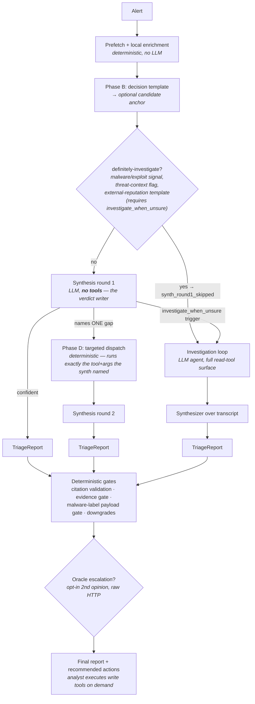

# Architecture

How soc-ai is put together, going deeper than the high-level diagram in the
README. This describes `main` as of the 1.2 line.

## Process model

- A **single FastAPI process**, async end-to-end (`soc_ai/main.py`).
- All long-lived clients are constructed **once** in the lifespan manager
  (`lifespan()` in `main.py`) and stashed on `app.state`: the SO auth client,
  the Elasticsearch client, the optional MISP client, the audit logger, and
  the local-enrichment context (blocklists + MaxMind + cloud-prefix DBs).
  They are torn down on shutdown.
- Request handlers pull these off `app.state` via the providers in
  `soc_ai/api/deps.py`. A fresh `InvestigationContext` is assembled per request
  (`get_investigation_ctx`) but shares the app-scoped clients.
- Application state persists in a local SQLite database (`soc_ai/store/`, Alembic
  migrations): users, sessions, API tokens, investigations, hunts, backtests,
  chat threads, config overrides, discovered internal identifiers, detection
  overrides, and operator runbooks. The tamper-evident audit trail is written
  separately to Elasticsearch (see *Audit pipeline*), so the immutable log lives
  on an index the application cannot edit in place.

## Request surface (`soc_ai/api/routes.py`)

| Route | Purpose |
|---|---|
| `POST /investigate` | Streams a triage as Server-Sent Events. Each message is `event: {kind}` + a JSON `StepEvent` payload. |
| `POST /find-alert` | Resolves an ES `_id` from row-level context supplied by a cross-origin API client (SO 3.0 doesn't embed `_id`s in the DOM). |
| `GET /healthz` | Liveness + a minimal config snapshot (auth mode, MISP configured). |
| `GET /metrics` | Prometheus 0.0.4 plain-text exposition (`soc_ai/metrics.py`). |

Write actions (ack / escalate / comment) are **not** on this surface: the
pipeline recommends them in the report, and the analyst executes them through
the actions API (`POST /api/v1/investigations/{id}/actions/{index}/execute`,
`soc_ai/api/webui/routes_actions.py`) — the single analyst write path.

> **Security posture:** the JSON API requires authentication when
> `API_AUTH_REQUIRED=true`: a session cookie (web login) or a bearer API token
> (`Authorization: Bearer scai_…`), enforced by `require_api_auth`
> (`soc_ai/api/security.py`); admin-only routes sit behind a separate admin gate.
> CORS is scoped to `CORS_ALLOW_ORIGINS` (else the configured `SO_HOST`), with
> `"*"` only as a last-resort fallback that logs a warning (`soc_ai/main.py`).
> Still deploy behind TLS on a trusted interface; see `docs/SAFETY_MODEL.md`
> and `SECURITY.md`.

## The triage funnel

Every triage runs through one entry point, `investigate()` in
`soc_ai/agent/orchestrator.py`, which delegates to
`_run_synth_first_pipeline()`. One pipeline, staged escalation — each stage
handles what the previous could not, at roughly 10× the cost.

### Role glossary

Names in code → what they actually are:

| Code name | Actual role |
|---|---|
| `build_synth_first_agent` ("synthesizer") | **The primary verdict writer (settle path)** — tool-less by design; the loop path uses the sibling `build_synthesizer` over the transcript, and failure paths emit deterministic fallbacks |
| `targeted_investigator` / Phase D | **Deterministic dispatcher** — not an agent, not an LLM; runs the one tool the synth named (`soc_ai/agent/targeted_investigator.py`) |
| `build_investigator` | **The investigation loop** — full tool-equipped agent, entered for definitely-investigate, `investigate_when_unsure` trigger, or `fast_triage_enabled=false` (forces loop for every alert) |
| Chat / Hunt agents | Share the read-tool surface from `soc_ai/agent/toolset.py`; chat adds `propose_verdict` + rule tuning, hunt uses wider windows and writes a `HuntReport` |
| Oracle | Opt-in second opinion via raw HTTP completion — **not** a pydantic-ai agent |

### Synth-first stage detail

- **Phase A — rich precompute:** `get_enriched_alert_context()` pivots the
  alert across host / user / community-id and runs local enrichment, producing
  an `EnrichedAlertContext`.
- **Phase B — decision template:** `match_decision_template()`
  (`soc_ai/agent/decision_templates.py`) runs ordered, pure-function templates
  over the enriched context and may hand the synth a *candidate verdict* (an
  anchor it can keep, refine, or override).
- **Definitely-investigate check (before Phase C):** `_definitely_investigate()`
  tests for three triggers: malware/exploit signal on the rule, a concurrent
  host threat-context flag, or an external-reputation decision-template match
  (e.g. a template in `EXTERNAL_REPUTATION_TEMPLATES`). This pre-check only
  runs when `investigate_when_unsure` is enabled. When true a
  `synth_round1_skipped` event is emitted and the pipeline routes straight to
  the investigation loop — Phase C is never called.
- **Phase C — synthesis round 1:** the heavy model reads the materialized
  evidence + candidate and emits a `TriageReport`. It has no tools and may
  include a `gap_for_investigator` naming **one** tool + exact args.
- **Phase D — targeted dispatch (optional):** if a gap was named and the loop
  was not entered, `soc_ai/agent/targeted_investigator.py` dispatches that
  single tool **deterministically** (no LLM in the loop), then synthesis
  round 2 reads the combined evidence. Phase D runs at most
  `phase_d_max_rounds` gap→dispatch→re-synthesize rounds (default 1); on a
  non-final round the synth may chain one more gap (e.g.
  `t_get_event_raw` → `t_decode_payload`).
- **Investigation loop (optional):** full tool-equipped agent. Entered when
  any of three conditions holds: `_definitely_investigate` returned true (loop
  skipped round 1); `_should_investigate` triggers (evidence gap +
  `investigate_when_unsure` setting); or `fast_triage_enabled=false` forces the
  loop for every alert regardless of round-1 confidence (loop_reason
  `"fast_triage_disabled"`). The synthesizer then runs over the full transcript.

Every report passes through the **post-synth validators** before the final
report is emitted (see below).

## Models & routing

- Models are reached through a **LiteLLM gateway** via an OpenAI-compatible
  surface (`_build_provider` / `build_*_model` in `soc_ai/agent/models.py`). A
  Nemotron-specific model profile (`_nemotron_profile`) adjusts tool-call
  behavior for the served models.
- Two aliases: a **fast** model (the bounded investigation loop, hunts, chat)
  and a **heavy** model (synthesizer). On the common triage path only the
  heavy model is called per alert.

## Tools & the read/write split

Every tool function is registered in a global registry (`soc_ai/tools/_registry.py`)
with a `read_only` flag. The **read-tool surface** — wrapping, dedup,
result-clamping, and per-role registration — is the sole responsibility of
`soc_ai/agent/toolset.py`, which defines all `t_*` tools once and exposes them
per-role via `register_read_tools(agent, ctx, role)`. Closures over the runtime
`InvestigationContext` keep the LLM-facing signatures semantic (no `auth` /
`elastic` params leak into the schema).

- **Read tools** (`t_query_events_oql`, `t_query_cases`, `t_query_detections`,
  `t_query_zeek_logs`, `t_get_playbooks`, `t_get_event_raw`, the `t_enrich_*`
  family, `t_lookup_runbook`, and more) auto-execute.
- **Write tools** (`ack_alert`, `escalate_to_case`, `add_case_comment`) are
  never exposed to the LLM for execution — the report *recommends* them, and
  they only run through the audited `execute_write_tool`
  (`soc_ai/tools/write_exec.py`) on an explicit analyst action.

Tool wrappers clamp result sizes and `max_results` to defend the model's
serving window, dedupe identical calls within a run, and translate exceptions
into structured error payloads rather than crashing the stream. Phase D's
dispatchable surface is the `PHASE_D_TOOLS` tuple exported from `toolset.py`.

## OQL trust boundary (`soc_ai/so_client/oql.py`)

This is the firewall between LLM-generated query strings and Elasticsearch.
Raw OQL **never** reaches ES. The pipeline is:

1. `parse_oql` — split on top-level `|`, parse the boolean filter with a Lark
   grammar into a typed AST, parse pipe stages with regex.
2. `validate_oql` — walk the AST and reject any field not on the whitelist
   (`oql_fields.json`), reject repeated/unsafe pipe stages, and cap `head` at a
   hard 10,000-row ceiling.
3. `ast_to_es_dsl` — translate the validated AST into an ES search body.

`query_events_oql` also excludes synthetic-eval docs
(`synth.scenario_id`) by default so fixtures can't leak into real responses.

## Write-action flow (`soc_ai/tools/write_exec.py` → `execute_write_tool`)

1. The pipeline never executes a write itself — it lists write tools in
   `TriageReport.recommended_actions` (advisory only).
2. The analyst executes a recommendation from the report via the actions API
   (`POST /api/v1/investigations/{id}/actions/{index}/execute`). Group ack /
   escalate and the auto-ack (on by default, confidence- and severity-gated,
   `auto_ack_fp_enabled=false` to disable) use the same path.
3. Every execution runs through `execute_write_tool`: restricted to the three
   write tools, audited fail-closed (the audit *intent* record is written
   before Security Onion is touched), and idempotent for already-executed
   actions (persisted `action_executed` events / already-acked alerts return
   ok-with-note instead of writing twice).

Full spec in [SAFETY_MODEL.md](SAFETY_MODEL.md).

## Post-synth validators

The pipeline runs a model-agnostic validator chain on the final report before
emission (`_synth_first_post_validate` in `soc_ai/agent/gates.py`): citation
validation + capping, a verdict floor rewrite (sub-floor confidence →
`needs_more_info`), targeted downgrades (e.g. solicited internal ICMP echo
replies), the malware-label payload gate (GATE A), and the hard evidence gate
(no tool call + no strong template + no IOC/pivot hit → `needs_more_info`).
These are **graders, not gatekeepers**: they reshape the report
deterministically rather than retrying the model.

## Reasoning-trace handling (`soc_ai/agent/reasoning.py`)

Served reasoning models emit `<think>…</think>` blocks. The reasoning module
strips these from user-facing content and routes them to the audit trail (and,
when `AUDIT_REDACT` is on, through the redactor). Traces are never shown in the
panel summary.

## Audit pipeline (`soc_ai/audit/`)

Every `StepEvent` is mirrored to a date-stamped Elasticsearch index
(`{AUDIT_INDEX_ALIAS}-YYYY.MM.dd`) via `AuditLogger`. Audit writes **fail open**:
a write error is logged locally and the event is dropped rather than crashing
the in-flight investigation (a local fallback queue is a noted follow-up).
Optional regex redaction (`audit/redact.py`) runs in-place when
`AUDIT_REDACT=true`. Schema and redaction policy: [SAFETY_MODEL.md](SAFETY_MODEL.md).

## MCP server (`soc_ai/mcp_server/`)

A FastMCP server (`python -m soc_ai.mcp_server`) exposes the **read-only** tool
subset to MCP clients; the three write tools are never registered. It reuses
the same tool functions as the FastAPI path.

## Local enrichment (`soc_ai/enrichment/`)

No runtime egress: blocklists (URLhaus / ThreatFox / Feodo / Tor exit list /
operator seed), MaxMind GeoLite2 (ASN + City), and vendored cloud-provider
prefix lists are loaded from disk and refreshed by the
`soc-ai blocklists refresh` CLI subcommand. Every enrichment source is wrapped
so a missing/stale source degrades rather than blocks triage. MISP, if
configured, is the one optional network lookup.

## Offline eval harness (`soc_ai/eval/`)

Out of the request path. It samples real alerts (and optionally injects
synthetic true-positive scenarios into a lab index), runs the triage pipeline,
sanitizes the output, and grades it against the cloud oracle reached through the
same LiteLLM gateway. This is the **only** component that makes an external
(third-party model) call, it is opt-in, and the data is sanitized and
refuse-gated before it leaves. The synthetic-scenario catalogue it can inject is
documented in [`soc_ai/eval/synth_scenarios/README.md`](https://github.com/nuk3s/soc-ai/blob/main/soc_ai/eval/synth_scenarios/README.md).
