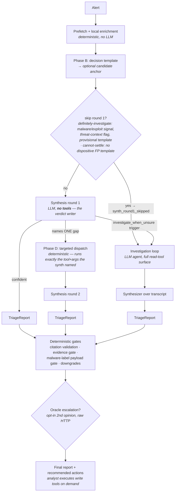

# Architecture

This page describes how soc-ai is built. It goes deeper than the high-level
diagram in the README. It describes `main` as of the 1.5 line.

## Process model

- soc-ai runs as a single FastAPI process, async end to end. The entry point is
  `soc_ai/main.py`.
- The lifespan manager `lifespan()` in `main.py` builds every long-lived client
  once and stores it on `app.state`. The clients are the SO auth client, the
  Elasticsearch client, the optional MISP client, the audit logger, and the
  local-enrichment context. The local-enrichment context holds the blocklists,
  MaxMind and the cloud-prefix databases. soc-ai closes them all at shutdown.
- A request handler reads these clients off `app.state` through the providers in
  `soc_ai/api/deps.py`. `get_investigation_ctx` assembles a fresh
  `InvestigationContext` for each request. That context shares the app-scoped
  clients.
- Application state persists in a local SQLite database under `soc_ai/store/`,
  with Alembic migrations. It holds the users, sessions, API tokens,
  investigations, hunts, backtests, chat threads, config overrides, discovered
  internal identifiers, detection overrides, and operator runbooks. soc-ai writes
  the tamper-evident audit trail to Elasticsearch instead. Read *Audit pipeline*
  below. The immutable log therefore lives on an index that the application
  cannot edit in place.

## Request surface (`soc_ai/api/routes.py`)

| Route | Purpose |
|---|---|
| `POST /investigate` | Streams a triage as Server-Sent Events. Each message holds `event: {kind}` and a JSON `StepEvent` payload. |
| `POST /find-alert` | Resolves an ES `_id` from row-level context that a cross-origin API client supplies. SO 3.0 does not embed an `_id` in the DOM. |
| `GET /healthz` | Liveness only. It says that this process answered. It probes no dependency, so it stays green through a grid outage or a gateway outage. The container healthcheck polls it, so `docker ps` reporting `healthy` says nothing about the product. It carries a minimal config snapshot for a bug report: the auth mode, and whether MISP is configured. For the health verdict use `GET /api/v1/health` or `soc-ai doctor`. |
| `GET /metrics` | Prometheus 0.0.4 plain-text exposition. The code is `soc_ai/metrics.py`. |

The write actions are not on this surface. A write action acknowledges an alert,
escalates it to a case, or comments on it. The pipeline recommends them in
the report. The analyst executes them through the actions API at
`POST /api/v1/investigations/{id}/actions/{index}/execute`. That route lives in
`soc_ai/api/webui/routes_actions.py`, and it is the single analyst write path.

> **Security posture:** the JSON API requires authentication if
> `API_AUTH_REQUIRED=true`. It accepts a session cookie from the web login, or a
> bearer API token as `Authorization: Bearer scai_…`. `require_api_auth` in
> `soc_ai/api/security.py` enforces this. An admin-only route sits behind a
> separate admin gate.
>
> CORS is scoped to `CORS_ALLOW_ORIGINS`, and it falls back to the configured
> `SO_HOST`. `"*"` is a last-resort fallback only, and `soc_ai/main.py` logs a
> warning for it. Deploy soc-ai behind TLS on a trusted interface. Read
> `docs/SAFETY_MODEL.md` and `SECURITY.md`.

## The triage funnel

Every triage runs through one entry point, `investigate()` in
`soc_ai/agent/orchestrator.py`. That function delegates to
`_run_synth_first_pipeline()`. There is one pipeline with staged escalation. Each
stage handles what the stage before it could not, at about 10 times the cost.

```mermaid
flowchart TD
    A[Alert] --> B[Prefetch + local enrichment<br/><i>deterministic, no LLM</i>]
    B --> C[Phase B: decision template<br/><i>→ optional candidate anchor</i>]
    C --> DI{"skip round 1?<br/><i>definitely-investigate: malware/exploit signal,<br/>threat-context flag, provisional template<br/>· cannot-settle: no dispositive FP template</i>"}
    DI -- yes → synth_round1_skipped --> G[Investigation loop<br/><i>LLM agent, full read-tool surface</i>]
    DI -- no --> D[Synthesis round 1<br/><i>LLM, <b>no tools</b> — the verdict writer</i>]
    D -- confident --> R2[TriageReport]
    D -- names ONE gap --> E[Phase D: targeted dispatch<br/><i>deterministic — runs exactly the tool+args the synth named</i>]
    E --> F[Synthesis round 2] --> R3[TriageReport]
    D -- investigate_when_unsure trigger --> G
    G --> H[Synthesizer over transcript] --> R4[TriageReport]
    R2 & R3 & R4 --> I[Deterministic gates<br/>citation validation · evidence gate ·<br/>malware-label payload gate · downgrades]
    I --> J{Oracle escalation?<br/><i>opt-in 2nd opinion, raw HTTP</i>}
    J --> K[Final report + recommended actions<br/><i>analyst executes write tools on demand</i>]
```

### Role glossary

The name in the code, and the real role:

| Code name | Actual role |
|---|---|
| `build_synth_first_agent` ("synthesizer") | The primary verdict writer on the settle path. It has no tools by design. The loop path uses the sibling `build_synthesizer` over the transcript. A failure path emits a deterministic fallback. |
| `targeted_investigator` / Phase D | A deterministic dispatcher. It is no agent and no LLM. It runs the one tool that the synth named. The code is `soc_ai/agent/targeted_investigator.py`. |
| `build_investigator` | The investigation loop. It is a full tool-equipped agent. It is entered on a definitely-investigate decision, on an `investigate_when_unsure` trigger, or on `fast_triage_enabled=false`. That setting forces the loop for every alert. |
| Chat / Hunt agents | They share the read-tool surface from `soc_ai/agent/toolset.py`. Chat adds `propose_verdict` and rule tuning. Hunt uses wider windows and writes a `HuntReport`. |
| Oracle | An opt-in second opinion over a raw HTTP completion. It is not a pydantic-ai agent. |

### Synth-first stage detail

- **Phase A, rich precompute:** `get_enriched_alert_context()` pivots the alert
  across the host, the user and the community ID. It runs local enrichment and
  produces an `EnrichedAlertContext`.
- **Phase B, decision template:** `match_decision_template()` in
  `soc_ai/agent/decision_templates.py` runs ordered pure-function templates over
  the enriched context. It can hand the synth a *candidate verdict*. That
  candidate is an anchor, and the synth can keep it, refine it or override it.
- **The definitely-investigate check, before Phase C:** `_definitely_investigate()`
  tests 3 triggers: a malware or exploit signal on the rule, a concurrent host
  threat-context flag, or a provisional benign decision-template match. This
  pre-check runs only if `investigate_when_unsure` is enabled. If the check is
  true, soc-ai emits a `synth_round1_skipped` event and routes straight to the
  investigation loop. Phase C never runs.
- **The cannot-settle check, beside it:** `_round1_can_settle()` asks whether a
  round-1 verdict could end the run at all. Only a dispositive false-positive
  template lets it, because round 1 has no tools and no message history, so
  `_is_evidence_backed()` rejects every round-1 report. On every
  other alert the loop runs and overwrites the round-1 verdict, so soc-ai skips
  the call: it emits `synth_round1_skipped` with reason `cannot_settle` and
  enters the loop with `loop_reason="round1_cannot_settle"`. The same function
  decides whether `_should_investigate()` accepts a round-1 verdict, so the two
  cannot disagree. The check yields when nothing else would produce a verdict.
  That is the `investigate_when_unsure=false` case with no forced loop. The
  `synth_round1_always` setting restores the call on every alert.
- **Template authority:** a candidate verdict is `dispositive` or `provisional`.
  A dispositive template reads what the rule detected, such as STUN and QUIC
  keepalives, DNSSEC record queries and NTP. It can settle an alert with no tool
  call, and that fast path is the reason decision templates exist. A provisional
  template reads a property of the endpoints, or the absence of a reputation hit.
  `clean_internal_traffic` and the two external-reputation templates are
  provisional. A provisional template proposes a verdict, steers the routing, and
  reaches the synthesizer as a prior. It cannot close a case. The default is
  `provisional`.
- **Phase C, synthesis round 1:** the heavy model reads the materialized evidence
  and the candidate, then emits a `TriageReport`. It has no tools. The report can
  include a `gap_for_investigator` that names one tool and its exact arguments.
- **Phase D, targeted dispatch, optional:** if the report named a gap and the
  pipeline did not enter the loop, `soc_ai/agent/targeted_investigator.py`
  dispatches that single tool deterministically, with no LLM in the loop.
  Synthesis round 2 then reads the combined evidence. Phase D runs at most
  `phase_d_max_rounds` rounds of gap, dispatch and re-synthesize. The default is
  1. On a round that is not the last one, the synth can chain one more gap, for
  example `t_get_event_raw` and then `t_decode_payload`.
- **The investigation loop, optional:** it is a full tool-equipped agent. Any of
  4 conditions enters it. `_definitely_investigate` returned true, and the loop
  then skipped round 1. `_round1_can_settle` returned false, and the loop again
  skipped round 1. `_should_investigate` triggers on an evidence gap with the
  `investigate_when_unsure` setting on. `fast_triage_enabled=false` forces
  the loop for every alert, whatever the round-1 confidence, with loop_reason
  `"fast_triage_disabled"`. The synthesizer then runs over the full transcript.

Every report passes through the post-synth validators before soc-ai emits the
final report. Read the section below.

## Models & routing

- soc-ai reaches a model through a LiteLLM gateway over an OpenAI-compatible
  surface. The code is `_build_provider` and `build_*_model` in
  `soc_ai/agent/models.py`. A Nemotron-specific model profile,
  `_nemotron_profile`, adjusts the tool-call behavior for the served models.
- A single analyst model feeds the investigator, the synthesizer, the hunt agent
  and the chat agent. `ANALYST_MODEL` names it, and `HEAVY_MODEL` is the
  legacy alias. The code reads `settings.analyst_model` in
  `soc_ai/agent/models.py`. The pre-1.0 split into a fast model and a heavy model
  is gone. The opt-in Oracle is the only second model, and soc-ai reaches it over
  raw HTTP and not over the pydantic-ai path.

## Tools & the read/write split

soc-ai registers every tool function in a global registry,
`soc_ai/tools/_registry.py`, with a `read_only` flag. `soc_ai/agent/toolset.py`
owns the read-tool surface alone. It owns the wrapping, the dedup, the result
clamping and the per-role registration. It defines every `t_*` tool once and
exposes them per role through `register_read_tools(agent, ctx, role)`. Closures
over the runtime `InvestigationContext` keep the LLM-facing signatures semantic,
so no `auth` or `elastic` parameter reaches the schema.

- **Read tools** auto-execute. They include `t_query_events_oql`,
  `t_query_cases`, `t_query_detections`, `t_query_zeek_logs`, `t_get_playbooks`,
  `t_get_event_raw`, the `t_enrich_*` family, `t_lookup_runbook`, and more.
- **Write tools** are `ack_alert`, `escalate_to_case` and `add_case_comment`.
  soc-ai never exposes them to the LLM for execution. The report *recommends*
  them. They run only through the audited `execute_write_tool` in
  `soc_ai/tools/write_exec.py`, on an explicit analyst action.

A tool wrapper clamps the result size and `max_results` to defend the serving
window of the model. It dedupes an identical call inside one run. It translates
an exception into a structured error payload and keeps the stream alive. The
dispatchable surface of Phase D is the `PHASE_D_TOOLS` tuple that `toolset.py`
exports.

## OQL trust boundary (`soc_ai/so_client/oql.py`)

This module is the boundary between an LLM-generated query string and
Elasticsearch. Raw OQL never reaches ES. The pipeline is:

1. `parse_oql` splits the query on the top-level `|`. It parses the boolean
   filter into a typed AST with a Lark grammar. It parses the pipe stages with a
   regex.
2. `validate_oql` walks the AST. It rejects any field that the whitelist
   `oql_fields.json` does not hold. It rejects a repeated or unsafe pipe stage.
   It caps `head` at a hard ceiling of 10,000 rows.
3. `ast_to_es_dsl` translates the validated AST into an ES search body.

`query_events_oql` also excludes synthetic-eval documents by default. It matches
them on `synth.scenario_id`, so no fixture leaks into a real response.

## Write-action flow (`soc_ai/tools/write_exec.py` → `execute_write_tool`)

1. The pipeline never executes a write itself. It lists the write tools in
   `TriageReport.recommended_actions`, and that list is advisory.
2. The analyst executes a recommendation from the report through the actions API
   at `POST /api/v1/investigations/{id}/actions/{index}/execute`. The group
   acknowledge, the group escalate and the auto-acknowledge use the same path.
   The auto-acknowledge is off by default. It gates on the confidence, the
   severity, and whether the run retrieved anything. Set
   `auto_ack_fp_enabled=true` to enable it.
3. Every execution runs through `execute_write_tool`. It accepts the 3 write
   tools only. It audits fail-closed, so soc-ai writes the audit *intent* record
   before it touches Security Onion. It is idempotent for an action that already
   ran. A persisted `action_executed` event, or an already-acked alert, returns
   ok-with-note, and soc-ai does not write twice.

[SAFETY_MODEL.md](SAFETY_MODEL.md) holds the full specification.

## Post-synth validators

The pipeline runs a model-agnostic validator chain on the final report before it
emits the report. The chain is `_synth_first_post_validate` in
`soc_ai/agent/gates.py`. It runs citation validation and capping. It runs a
verdict floor rewrite, so a sub-floor confidence becomes `needs_more_info`. It
runs targeted downgrades, for example on a solicited internal ICMP echo reply. It
runs the malware-label payload gate, GATE A. It runs the hard evidence gate: with
no tool call, no dispositive template that cites its grounds, and no IOC or pivot
hit, the verdict becomes `needs_more_info`.

These validators are graders and not gatekeepers. They reshape the report
deterministically, and they never retry the model.

The chain deliberately treats 2 things as no evidence at all. Coverage over an
empty citation set reads `0.0` with a `vacuous` marker, and not a vacuous `1.0`,
so no coverage threshold can be met by citing nothing. The confidence cap skips
the vacuous case, because "cited nothing" belongs to the evidence gate and not to
a citation-shape penalty. A template that settles an alert must also have its
grounds on the record. A dispositive template therefore lends its own
`cited_evidence` to a report that cited nothing, and the marker is
`template_grounds_adopted`.

## Reasoning-trace handling (`soc_ai/agent/reasoning.py`)

A served reasoning model emits `<think>…</think>` blocks. The reasoning module
strips them from the user-facing content and routes them to the audit trail. With
`AUDIT_REDACT` on, they pass through the redactor first. The panel summary never
shows a trace.

## Audit pipeline (`soc_ai/audit/`)

`AuditLogger` mirrors every `StepEvent` to a date-stamped Elasticsearch index,
`{AUDIT_INDEX_ALIAS}-YYYY.MM.dd`. An audit write fails open. soc-ai logs a
write error locally and drops the event, and the in-flight investigation
continues. A local fallback queue is a noted follow-up. Optional regex redaction
in `audit/redact.py` runs in place if `AUDIT_REDACT=true`.
[SAFETY_MODEL.md](SAFETY_MODEL.md) holds the schema and the redaction policy.

## MCP server (`soc_ai/mcp_server/`)

A FastMCP server exposes the read-only tool subset to an MCP client. Start it
with `python -m soc_ai.mcp_server`. It never registers the 3 write tools. It
reuses the same tool functions as the FastAPI path.

## Local enrichment (`soc_ai/enrichment/`)

Local enrichment makes no call at runtime. soc-ai loads the blocklists, the
MaxMind GeoLite2 databases and the vendored cloud-provider prefix lists from
disk. The blocklists are URLhaus, ThreatFox, Feodo, the Tor exit list and the
operator seed. MaxMind GeoLite2 supplies the ASN database and the City database.
The `soc-ai blocklists refresh` CLI subcommand refreshes them all.

Every enrichment source is wrapped, so a missing or stale source degrades triage
and never blocks it. MISP is the one optional network lookup, if you configure
it.

## Offline eval harness (`soc_ai/eval/`)

The harness sits outside the request path. It samples real alerts, and it can
inject synthetic true-positive scenarios into a lab index. It runs the triage
pipeline, sanitizes the output, and grades it against the cloud oracle. It
reaches the oracle through the same LiteLLM gateway. This harness is the only
component that calls a third-party model. That call is opt-in, and soc-ai
sanitizes and refuse-gates the data before it leaves.

[`soc_ai/eval/synth_scenarios/README.md`](https://github.com/nuk3s/soc-ai/blob/main/soc_ai/eval/synth_scenarios/README.md)
documents the synthetic-scenario catalogue that the harness can inject.
