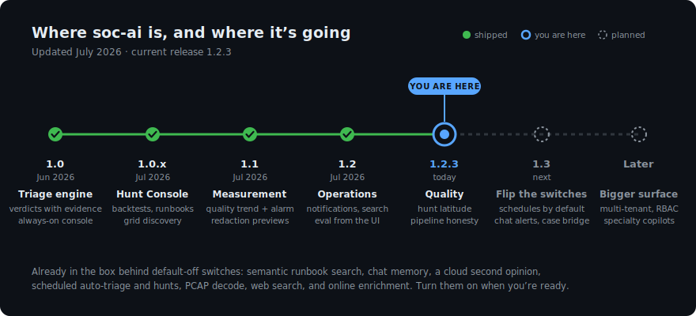

# Roadmap

soc-ai moves fast, and it moves in public. This page is the honest picture:
what has shipped, what you can turn on today, and what comes next.

## The story so far

**1.0 (June 2026) put the core promise in your hands:** an agent that reads an
alert on your Security Onion grid, investigates it with real tool calls, and
lands a verdict with the evidence attached. No verdict without evidence, no
write without your click, and nothing leaving your network. The always-on web
console shipped on day one.

**The 1.0.x line made it a place you could work all day.** The Hunt Console
took plain-English objectives across the whole estate. Backtests let you replay
the agent against alerts you had already dispositioned, so trust could be
measured instead of assumed. Runbooks gave the agent your team's own
procedures to cite, and grid discovery taught it to learn what data your
deployment actually has instead of assuming.

**1.1 was the measurement release.** A nightly quality eval with a trend line
and a regression alarm, redaction previews you can inspect span by span, and a
real runbooks workspace. If the agent gets worse, you find out from a chart,
not from a bad morning.

**1.2 came from a full analyst shift on a live deployment.** Fourteen findings
went in; fourteen fixes came out. Notifications, entity search, a maintenance
panel, pipeline-error visibility with one-click dismiss, group acknowledge,
deep re-run, and the quality eval now schedulable straight from the dashboard.

**1.2.3 is where we are today.** When the model stumbles, the pipeline now
records exactly why and recovers from the most common failure on its own. And
hunts got their latitude back: generic sweeps hunt the telemetry (beacons,
first-seen destinations, odd cadences) instead of re-triaging the alert queue,
because triage already owns that.

## Already in the box, waiting on a switch

A lot of soc-ai ships dark: built, tested, and off by default, because you
should decide what runs on your network. Today that list includes semantic
runbook search and reranking (point them at an embeddings model on your
gateway), chat memory, the cloud Oracle second opinion, scheduled auto-triage,
recurring hunts, scheduled identifier discovery, outbound notifications, PCAP
fetch and decode, web search, and online enrichment. Each one is a config
toggle, most of them hot-applied from the admin page.

## What's next

**1.3 is the flip-the-switches release.** The schedulers have been burning in
on a live deployment; the ones that earn it graduate to on-by-default. Chat
notifications (Slack, Teams, Matrix) and a richer case bridge into Security
Onion are the leading candidates alongside them.

**Further out:** multi-tenant deployments with role-based access for MSSPs and
multi-team SOCs, detection mutation tools if a supported path into SO's
detection store lands, and specialty copilots (detection engineering, IR
playbooks) on the same audited core.

Plans change when evidence says they should; this page tracks reality, not
aspiration. The full version-by-version detail is in the
[changelog](project/changelog.md).
