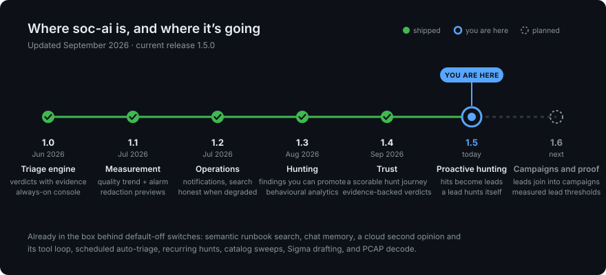

# Roadmap

soc-ai moves fast, and it moves in public. This page is the honest picture:
what has shipped, what you can turn on today, and what comes next.

## The story so far

**1.0 (June 2026) put the core promise in your hands:** an agent that reads an
alert on your Security Onion grid, investigates it with real tool calls, and
lands a verdict with the evidence attached. No verdict without evidence, no
write without your click, and nothing leaving your network. The always-on web
console shipped on day one.

**The 1.0.x line made it a place you could work all day.** The Hunt Console
took plain-English objectives across the whole network. Backtests let you replay
the agent against alerts you had already dispositioned, so trust could be
measured instead of assumed. Runbooks gave the agent your team's own
procedures to cite, and grid discovery taught it to learn what data your
deployment actually has instead of assuming.

**1.1 was the measurement release.** A nightly quality eval with a trend line
and a regression alarm, redaction previews you can inspect span by span, and a
real runbooks workspace. If the agent gets worse, you find out from a chart,
not from a bad morning.

**1.2 came from a full analyst shift on a live deployment.** Fourteen findings
went in; fourteen fixes came out. Notifications, entity search, a maintenance
panel, pipeline-error visibility with one-click dismiss, group acknowledge,
deep re-run, and the quality eval now schedulable straight from the dashboard.

**1.2.6 rebuilt the Config page master-detail** — a section nav driving a
single-section pane instead of a ~36-screen scroll — with settings search
everywhere (the page, the command palette), an Apply bar that names each
staged change, and identifier lists that page, filter, and bulk-edit. An About
page finally surfaces the running version, with an opt-in,
zero-egress-by-default GitHub update check. **1.2.7** adapted the pipeline to
whatever analyst model sits behind the gateway — a fitness battery and a
standalone probe for judging a candidate backend before production depends on
it. Before that: when the model stumbles, the pipeline now records exactly why
and recovers from the most common failure on its own. And hunts got their
latitude back: generic sweeps hunt the telemetry (beacons, first-seen
destinations, odd cadences) instead of re-triaging the alert queue, because
triage already owns that. The latest patch tightened the edges an operator
actually hits: scheduled hunts say plainly when they are paused instead of
showing a switched-on pill that never fires, a transient grid blip during
triage is retried instead of dropped, the nightly regression alarm no longer
pages on a single flipped verdict at small sample sizes, and the config console
groups each integration's switch with the key it needs. The most recent work
refreshed the alert workspace: design-token theming, a filter bar that morphs
into bulk actions instead of shifting the table below it, toast notifications
with a one-click clear, and freshness markers that flag a stalled poll. It
shipped alongside a code-review remediation and a run of dogfood fixes.

**1.2.8** was the degraded-grid release: what soc-ai says
when Security Onion is down, saturated, stalled, or reading only some of its
shards is now engineered with the same care as what it says when everything
works — partial reads raise instead of passing for whole, a sweep that
couldn't read the backlog is marked degraded instead of reported as empty, and
every surface an analyst depends on, from the topbar health pill to the audit
chain, answers honestly instead of asserting numbers it never obtained. The
rule it enforces end to end: a false all-clear outranks any loud error.

**1.2.9 was the front-door release:** the same care, aimed at the first thirty
minutes. The installer asks how you'll reach a model (a local endpoint stays
the primary; a cloud key gets redacted egress by default and a printed
disclosure), the doctor preflights the traps that used to cost an afternoon
(the audit write grant, a narrowed index pattern, DNS and TLS inside the
container) with the fix named on every failing line, and the console opens as
an analyst tool: eight day-1 config decisions with the rest behind per-section
reveals, an Operate hub for the trust instruments, and a setup-health card that
says what is broken instead of looking calm.

**1.3 made soc-ai a hunting tool, not a triage tool that also hunts.** A
finding from a hunt can be promoted into a full investigation on its own
anchor evidence, so "this looks odd" becomes a verdict without retyping
anything. Four behavioral analytics sweep the network rather than the alert
queue: beaconing cadence, DNS entropy, DCE-RPC operation histograms, and
first-seen external destinations. And a confirmed true positive can be drafted
into a Sigma rule, exported for you to review and deploy yourself. Nothing
writes to your detection store.

**1.3.2 was an adversarial security audit of our own work** — eighteen planted
attacks against the redaction boundary, the citation grounding, and the route
guards, with every finding either fixed or refuted on the record. Two of the
defects it found were in earlier fixes.

**1.4 is where we are today: the trust release.** Its subject is whether you
can check soc-ai's judgement instead of taking it on faith.

The evaluation could always plant an attack and score the verdict on one alert.
It could never score the thing the product is actually for: a plain-English
hunt across your network that surfaces a finding, promotes it, and reaches a
verdict. That journey is now scored end to end, and when it falls short it says
which step broke — the hunt found nothing, the finding cited no usable
evidence, or the investigation reached the wrong verdict.

A verdict must now rest on evidence soc-ai actually retrieved. The old checks
confirmed that evidence had been gathered, never that it supported the
conclusion, so a single successful lookup was enough to let a confidently wrong
true positive stand — including one steered by text planted in the network
traffic being analysed.

And the cloud second opinion, if you turn it on, can now check its own claims
with read-only tools instead of reasoning from whatever the local run happened
to write down. Building that proved the outbound privacy gate was a blocklist:
it blocked the field names we had thought of, and a bare internal hostname has
no shape a filter can catch. So it flipped to the other polarity. Any value
from a field the sanitizer does not recognise is masked before the model can
see it, which makes the boundary complete by construction rather than by
enumeration.

One more thing in 1.4, less visible and more important than it sounds: the
evaluation can run each scenario several times and report a confidence
interval. A test-retest on code that provably could not affect the outcome
moved a headline recall number by 0.235 and flipped six of twenty-five
scenarios between pass and fail. A single batch cannot tell a real improvement
from a coin flip, and now it does not pretend to.

## Already in the box, waiting on a switch

A lot of soc-ai ships dark: built, tested, and off by default, because you
should decide what runs on your network. Today that list includes semantic
runbook search and reranking (point them at an embeddings model on your
gateway), chat memory, the cloud Oracle second opinion and its tool loop,
scheduled auto-triage, recurring hunts, scheduled identifier discovery,
outbound notifications, PCAP fetch and decode, Sigma rule drafting, web search,
and online enrichment. Each one is a config toggle, most of them hot-applied
from the admin page.

## What's next: hunting that starts without you

Everything through 1.4 waits for a person. An alert arrives, or you type an
objective. The next line is about soc-ai deciding what to go looking for.

**Analytic hunts that don't spend a model.** Every hunt today runs a language
model over the whole objective, which puts a floor under what it costs to hunt
and a ceiling on how often you can. Declarative hunts — a cheap query for
candidates, deterministic code to refine them, the model spent only on what
survives — make hunting cheap enough to leave running.

**Baselines worth comparing against.** The analytics that shipped in 1.3
measure cadence, entropy, and rarity. None of them knows what normal looks like
for a particular host, at a particular hour, next to hosts that do the same
job. "Unusual for this machine, compared to its peers, at this time of day" is
the question we want to be able to ask.

**Hunts that trigger themselves.** When a cluster of alerts shares a host, or a
run of activity walks from reconnaissance to exploitation to command-and-
control, that is the moment a hunt should start — not the next time somebody
opens the console.

**Further out:** multi-tenant deployments with role-based access for MSSPs and
multi-team SOCs, deploying drafted detections into Security Onion if a
supported path lands, and specialty copilots (detection engineering, IR
playbooks) on the same audited core.

Plans change when evidence says they should; this page tracks reality, not
aspiration. The full version-by-version detail is in the
[changelog](project/changelog.md).
