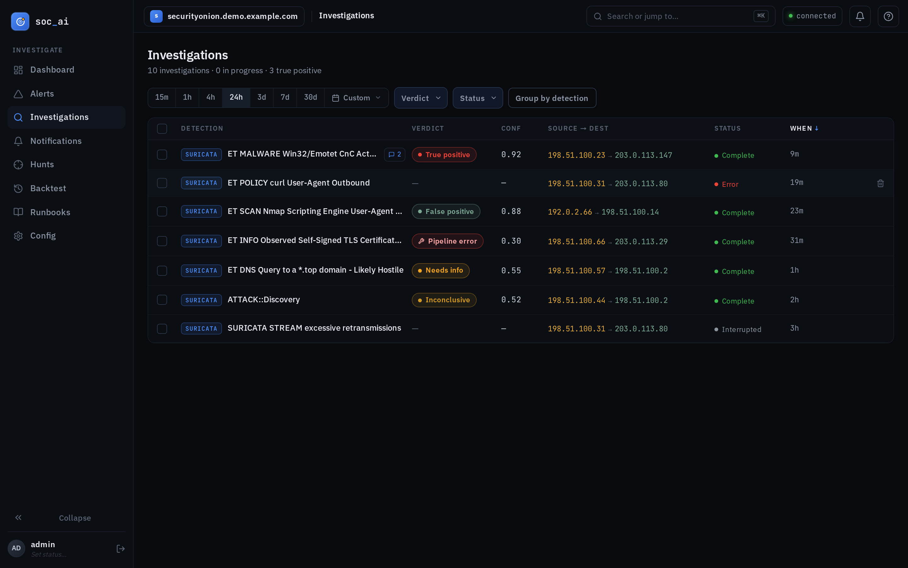

# soc-ai web UI — operator guide

The soc-ai web UI is a self-hosted triage console for Security Onion alerts. It
runs on the soc-ai host at **`https://<host>:8443/app`** behind session auth.
This guide is a practical reference for the analyst/operator surfaces.


> **Front door is `/app`** — the React console. It is the only web surface;
> bare `/` redirects to `/app/alerts` and login lands there. (The legacy
> server-rendered `/ui` console has been removed.)

> **First run / self-signed cert:** the UI serves over HTTPS with a self-signed
> cert. Visit the base URL once and accept the cert warning before signing in —
> otherwise the browser refuses the connection with an opaque `TypeError: Failed
> to fetch`.

## Sign in

`/app/login` — username + password. Two roles:

- **analyst** — full triage console (alerts, hunts, investigations).
- **admin** — everything an analyst can do **plus** the config console (`/app/config`).

The first admin (`admin`) is bootstrapped on first start; its generated password
is printed once to the service log. Recover it from the log for your deploy path:

```bash
# systemd / host-venv deploy
journalctl -u soc-ai | grep -i password
# Docker deploy
docker compose logs soc-ai | grep -i password
```

Change it after first login (Config → Users → reset password).

## Triage console — `/app/alerts`


The main pane: Security-Onion-style alert groups (by rule), newest first.

- **Filter / sort** — time range, severity, sort order, and a free-text OQL box.
- **Expand a group** — click a group row to load its recent events.
- **Hunt** — start an AI investigation for an alert/group. Hunts run as
  **background tasks**: they survive closing the drawer, run concurrently, and
  every run is recorded. Live progress (phase / elapsed / tools called /
  enrichments) streams into the drawer.
- **Verdict badges** — each group/alert shows its latest investigation verdict
  (true_positive / false_positive / needs_more_info / running / error). A dashed
  badge with an "inherited" tooltip means the verdict was inherited from a
  **similar** alert (same rule, same src/dst pair, within the inherit window) —
  visible at both the individual and **group** level.
- **Permalinks** — every investigation has a shareable URL
  (`/app/investigation/{id}`), created even while a hunt is still running.
- **⚡ Auto-triage** — sweep the current view and hunt everything not already
  covered. Use the **severity checkboxes** (default critical + high) to choose
  which severities it acts on. A single run is capped (`auto_triage_max_targets`,
  default 25) so one click can't spawn dozens of hunts; uncovered overflow is
  picked up by the next run. The status chip shows hunted/total/skipped + the
  chosen severities.

## Investigations — `/app/investigations`



A list of all past + in-flight investigations (verdict, rule, when, who started
it) with permalinks. Use it to review history and find a prior verdict.

**Stale-run reaping:** investigations left `running` by a crash/restart/network
drop are cleaned up automatically — on startup every orphaned `running` row is
marked `error` (its worker died with the previous process), and a periodic sweep
marks any run still `running` past `investigation_reaper_minutes` (default 30).
No more manual SQL to clear orphans.

## Config console — `/app/config` (admin only)

In-UI configuration. A non-admin who reaches it gets a clean 403 (no login loop).

### Settings sections (Oracle / Agent / PCAP)

Editable, **non-secret** runtime settings. Each row shows a **source badge**:

- `env` — the value comes from `.env` (the default).
- `db` — an admin override is set (stored in the `config_overrides` table).

Changes are **hot-applied**: saving persists the override *and* mutates the live
settings, so it takes effect on the **next investigation with no restart**. The
overrides are re-applied at startup, so they survive restarts. Editable keys:

- **Oracle** — `oracle_enabled` (the cloud frontier-model second opinion;
  everything sent to it is sanitized first), `oracle_model`, and the escalation
  thresholds (`oracle_escalate_*`). This is the home for the Oracle toggle.
- **Agent** — `investigate_when_unsure` (run the bounded investigation loop when
  the fast round-1 verdict isn't evidence-backed).
- **PCAP** — `pcap_enabled` (fetch + decode raw packets on demand via the SO
  sensor's Suricata pcap ring).

### Connection (env-managed, read-only)

LLM gateway, Security Onion, and Elasticsearch connection details are shown
read-only with **secrets masked** (`••••••`) — they are managed in `.env` on the
host and never editable or echoed through the UI.

- **Test connection** buttons probe the **LiteLLM gateway** (`GET /v1/models`,
  reports model count) and **Elasticsearch** (`ping`, reports cluster + version).
  Results are inline ✓/✗ and never contain a secret.

### Users

Add users (username / password ≥ 8 / role), enable/disable, reset password
(shown **once**), and change role. Guards: you can't disable your own account,
and you can't disable or demote the **last enabled admin**.

### API tokens

Mint API tokens (the `scai_…` value is shown **once** at creation — copy it then;
only its hash is stored) and revoke them. Tokens are for programmatic API
access (automation / integrations) once `API_AUTH_REQUIRED` is enabled.

## Safety model (recap)

Every **read** tool the agent uses is read-only. Every **write** tool (anything
that changes Security Onion state — ack, escalate-to-case, comment) requires an
explicit human **Approve/Reject** in the UI. The agent can *recommend* a write
but never executes one on its own. See [SAFETY_MODEL.md](SAFETY_MODEL.md) and the
agent capability surface in [AGENT_TOOLS.md](AGENT_TOOLS.md).
