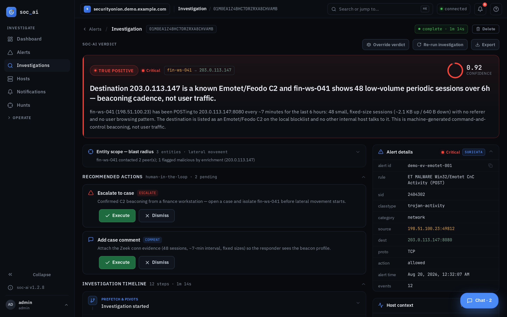
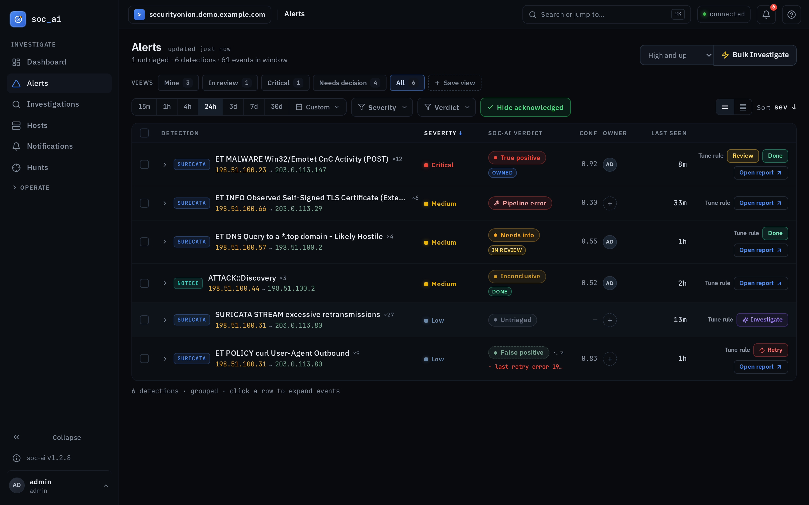
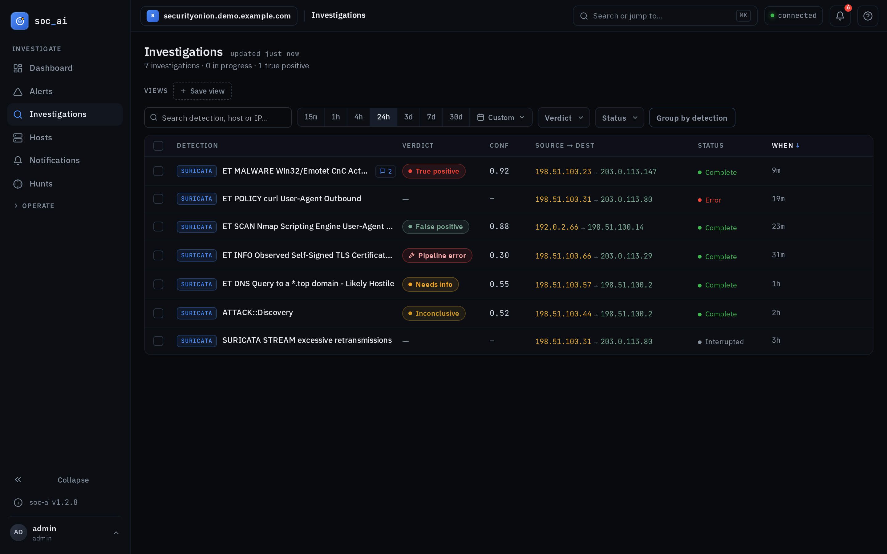
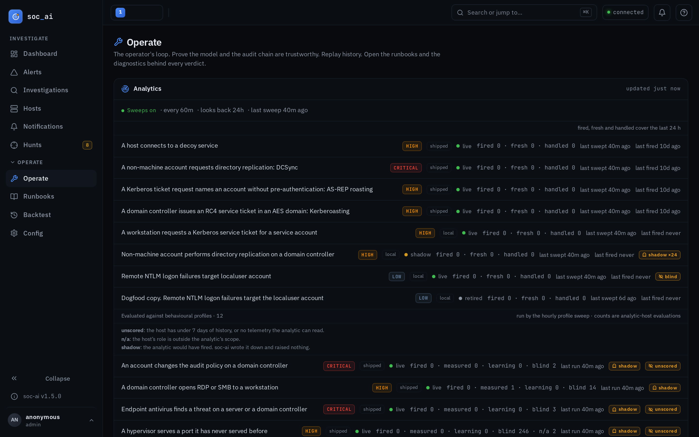
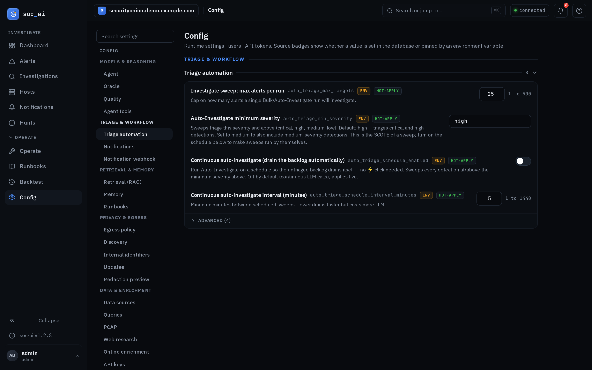

# soc-ai web UI: operator guide

The soc-ai web UI is a self-hosted triage console for Security Onion alerts. It
runs on the soc-ai host at **`https://<host>:8443/app`** behind session auth.
This guide is a practical reference for the analyst/operator surfaces.



> **Front door is `/app`**, the React console. It is the only web surface;
> bare `/` redirects into it and signing in lands you on the Dashboard. (The
> legacy server-rendered `/ui` console has been removed.)

> **First run / self-signed cert:** the UI serves over HTTPS with a self-signed
> cert. Visit the base URL once and accept the cert warning before signing in;
> otherwise the browser refuses the connection with an opaque `TypeError: Failed
> to fetch`.

## Sign in

`/app/login`: username + password. Two roles:

- **analyst**: full triage console (alerts, hunts, investigations).
- **admin**: everything an analyst can do **plus** the config console (`/app/config`).

The first admin (`admin`) is bootstrapped on first start; its generated password
is written **once** to a locked-down sidecar file,
`<soc_ai_data_dir>/bootstrap-admin-password.txt` (mode `0600`) — not to the
service log, which is often readable by the same audience the credential must
stay secret from. Read it for your deploy path:

```bash
# Docker deploy (default data dir /var/lib/soc-ai/data)
docker exec soc-ai cat /var/lib/soc-ai/data/bootstrap-admin-password.txt
# systemd / host-venv deploy
cat "$SOC_AI_DATA_DIR/bootstrap-admin-password.txt"
```

Only if the data dir was not writable at startup does soc-ai fall back to
logging the plaintext (`journalctl -u soc-ai | grep -i password` /
`docker compose logs soc-ai | grep -i password`); on the normal path the log
holds only a pointer line, not the password.

Change it after first login (Config → Users → reset password), then **delete the
sidecar file** — it is no longer needed and should not linger on the volume.

## Navigation

The sidebar groups into two. **Investigate** (Dashboard, Alerts,
Investigations, Hosts, Notifications, Hunts) stays open; it's the loop most of
a shift runs in. **Operate** (the Operate hub, Runbooks, Backtest, Config)
starts collapsed, since those are once-a-shift or once-a-week stops rather
than per-alert ones. Click its heading to expand it, or navigate straight to
one of its screens: Operate expands itself whenever the current page lives
inside it, so your screen is never hidden behind a closed group.

## Dashboard (`/app/dashboard`)

Where signing in lands you. What the grid is doing right now and what soc-ai
has made of it, with a box to ask about either.

### Setup health

A persistent card at the top of the Dashboard's side column. Persistent means
it never hides itself the way the panels below it do when there's nothing to
review. Clean, it's one compact line: "All checks passing," with how long ago
that was confirmed. Degraded, admins see each failing or warned check by
name, with its detail and a hint where there is one, plus a **Re-check**
button that forces a fresh check past the ten-minute cache, for when the
problem is already fixed. A re-check that itself fails says so ("Re-check
failed — try again") and leaves the last known-good rows on screen instead of
blanking them. Analysts get a count and a pointer to Config → Diagnostics,
never the row names.

It's fed by the same doctor checks Wave 1 added, minus the model fitness
probe. That one can take a couple of minutes, too slow for a dashboard poll,
so fitness stays on the model battery in Config.

### Ask soc-ai

A chat that answers on the spot, using the same read tools as the investigation
chat and taking about as long. Ask it what datasets you have, which rule was
noisiest overnight, or what a host has been up to.

- **One rolling thread per analyst**, kept across navigation and restarts. Two
  analysts don't see each other's questions. **Clear** discards yours.
- **It proposes hunts, it never starts one.** When answering would take a sweep
  across many hosts or a long window, the turn comes back with a **Start hunt**
  card holding an objective the agent wrote from what it just looked at, and a
  line on what the sweep would settle. Both are on the card before you decide;
  pressing **Start hunt** launches that objective and opens the running hunt.
- **What it can't do:** no write actions, no verdict changes, no ack or
  escalate. Read tools only.
- **Turning it off:** Config → Models & Reasoning → Agent → *Dashboard chat*.
  Hot, so it takes effect without a restart; the box disappears from the
  Dashboard rather than failing when someone types. Do that if a shared analyst
  model is already saturated by the triage backlog — the assistant sits on the
  screen everyone lands on, which makes it the easiest place in the product to
  spend inference capacity without meaning to. Nothing runs while nobody types,
  and switching it off keeps stored threads.

### Outcome and severity tiles

The verdict tiles count alert **groups** over the range you picked. The four
settled verdicts open the Investigations list filtered to that verdict.
**Untriaged** goes to `/app/alerts` instead, because a group nobody has
investigated has no investigation row to show; the link carries your range and
un-hides acked groups, so the destination holds exactly what the tile counted.

The severity bars go to the same list, filtered to that severity.

### Verdict quality

The trend from the nightly micro-eval (see
[DOCKER.md](DOCKER.md#the-nightly-quality-micro-eval-schedule-it-in-app-or-from-host-cron)
for scheduling it). The badge says which instrument measured each point:
**oracle graded** points carry an agreement rate, **locally measured** points
carry fallback and error rates instead. The two are never blended on one line.

Under the headline rate sits the grade composition, "3 agree · 2 partial". A
partial critique ("right verdict, thin reasoning") costs the rate exactly as
much as a flat disagreement, and a bare 60% can't tell you which you got — one
is a prompt to tighten, the other a regression to chase.

When a point alarms, the card prints the path to that run's eval bundle. That
directory holds the oracle critiques, which are the only evidence for or against
the alarm. It is a path on the soc-ai host, not a link: read it with
`docker exec soc-ai cat <path>/report.md`.

## Triage console (`/app/alerts`)



The main pane: Security-Onion-style alert groups (by rule), newest first.

- **Filter / sort:** time range, severity, sort order, and a free-text OQL box.
- **Expand a group:** click a group row to load its recent events.
- **Hunt:** start an AI investigation for an alert/group. Hunts run as
  **background tasks**: they survive closing the drawer, run concurrently, and
  every run is recorded. Live progress (phase / elapsed / tools called /
  enrichments) streams into the drawer.
- **Verdict badges:** each group/alert shows its latest investigation verdict
  (true_positive / false_positive / needs_more_info / running / error). A dashed
  badge with an "inherited" tooltip means the verdict was inherited from a
  **similar** alert (same rule, same src/dst pair, within the inherit window),
  visible at both the individual and **group** level.
- **Permalinks:** every investigation has a shareable URL
  (`/app/investigation/{id}`), created even while a hunt is still running.
- **⚡ Auto-triage:** sweep the current view and hunt everything not already
  covered. Use the **severity checkboxes** (default critical + high) to choose
  which severities it acts on. A single run is capped (`auto_triage_max_targets`,
  default 25) so one click can't spawn dozens of hunts; uncovered overflow is
  picked up by the next run. The status chip shows hunted/total/skipped + the
  chosen severities.

## Investigations (`/app/investigations`)



A list of all past + in-flight investigations (verdict, rule, when, who started
it) with permalinks. Use it to review history and find a prior verdict.

**Stale-run reaping:** investigations left `running` by a crash/restart/network
drop are cleaned up automatically. On startup every orphaned `running` row is
marked `error` (its worker died with the previous process), and a periodic sweep
marks any run still `running` past `investigation_reaper_minutes` (default 30).
No manual SQL needed to clear orphans.

## Hosts (`/app/hosts`)

What soc-ai has concluded about each machine on your network, and what you have
declared instead. Two screens.

**The list** (`/app/hosts`) is one row per host: address, role, hostname,
criticality, how many fields each lane holds, event count, last seen. Search
matches an address or a hostname; the **Role** and **Lane** selects narrow to a
role, or to hosts a human has touched ("declared") versus hosts nobody has
("inferred only"). Sort by last seen, first seen, stalest, busiest or address.
Click a row to open the host.

Above the table sit four counts of the whole network. The panel header below
counts what your filters match; these four never do. **All hosts** carries how
many have no clean build, meaning never swept or errored on the last attempt.
**Named** is hosts whose name the resolver will assert, so it agrees with the
Hostname column rather than with whatever is stored. **Reporting** is hosts
where an agent on the machine reports about itself, and it is the only place
the console shows how far host-log shipping has got. **Needs review** is the
open disagreements, the same number the queue carries. Under the four sits the
age of the numbers — "Last swept 4h ago", and a note while automatic sweeps are
off, since nothing else refreshes them. A count that could not be read shows a
dash, never a zero.

**The host page** (`/app/hosts/<ip>`), top to bottom:

- **The banner** names the machine — hostname if anything knows one, otherwise
  the address — with its role, where that role came from, OS, criticality, and
  whether the machine reports on itself. "no agent data" means every field below
  was observed from the network rather than told to us by the host.
- **Four counters**: services it answers on, accounts seen authenticating,
  connection volume, and alerts over seven days. Under the alert count sits an
  **all alerts · 7d** link, and it means what it says: the alerts console
  filters by time, severity and verdict, never by host, so it opens on the whole
  network's detections over those days with this host's among them.
- **Peers, volume and users** over the window you pick — 24h or 7d.
- **Twelve field cards**, one per dossier field.

An internal address opened from anywhere in the console lands here: alert rows,
the peer graph, and old `/entity/<ip>` links all redirect. External addresses
still open the Entity screen, because the sweep only builds hosts inside your
`internal_cidrs`.

### The two lanes

Every field holds up to two answers and they never overwrite each other:

- **inferred** — what the sweep concluded, with a provenance rung (what kind of
  signal it came from), a confidence, and the evidence behind it under **Why?**.
- **operator** — what you declared. Stored in its own columns, so no rebuild can
  clobber it.

Nothing is a stored "current value". The page resolves each field on read,
operator lane first, then the inferred value if it clears the confidence floor
(`dossier_min_confidence`) and has been re-confirmed inside the freshness window
(`dossier_staleness_hours`). A field that resolves to nothing says which of
those it failed, because "no signal yet" and "observed but too weak to assert"
are different answers.

### Declaring, accepting, keeping yours (admin)

On any field card:

- **Declare a value** (**Edit declaration** once one exists) writes your value
  and an optional note, recorded with your name and shown back on the card.
  Three fields — services offered, activity profile, management plane — hold
  structured values and take JSON.
- **Hand back to the builder** deletes your override and lets the sweep's answer
  stand again.
- When the sweep disagrees with something you declared, the card says so and
  names the kind: the evidence points elsewhere, the evidence it rested on is
  gone, or the address appears to have rebound to a different machine. Then:
  - **Accept inference** (confirm with **Discard my value**) drops your override
    and takes the sweep's answer.
  - **Keep mine** keeps yours and stops the question for a while. The interval
    doubles each time you press it, capped at 90 days.

Analysts see all of this read-only. Declaring, accepting, keeping and running a
sweep are admin-only.

A disagreement has to earn its way onto the screen: three consecutive builds
that disagree (`dossier_conflict_min_observations`) before you are prompted, and
at most one prompt per field per 14 days
(`dossier_conflict_prompt_interval_hours`). One build agreeing resets the count.

### Running the sweep

**The scheduled sweep is off by default** (`dossier_schedule_enabled`). A sweep
is hundreds of hosts across several Elasticsearch queries each, so you decide
when it runs. Until it has run at least once the Hosts screen is empty — that is
a sweep that has not happened, not a network with no hosts on it.

- **Rebuild now** on the Hosts screen (admin) runs one in the background and
  reports what it built.
- Config → Host dossier turns on the schedule and sets its interval. Every
  setting there is hot: no restart, and the next sweep picks it up.

## Operate hub (`/app/operate`)



A map of the console's trust instruments: six cards, each naming one thing
soc-ai can prove and linking to where you prove it. It carries no live status
of its own. That's the Dashboard's setup-health card's job.

- **Model fitness**: prove the analyst model is fit before triage depends on
  it. Links to Config → Agent.
- **Verdict quality**: prove the verdicts held up, the nightly micro-eval
  trend. Links to Config → Quality.
- **Audit chain**: prove the tamper-evident record is intact. Links to
  Config → Diagnostics, which carries a **Verify audit chain** button.
  Pressing it reports one of four outcomes: intact (green check, records
  verified), partial verification (amber; capped to the start of the chain,
  not the whole thing), tampered (red; names the sequence number where it
  breaks), or couldn't verify (amber; the console couldn't read the chain at
  all). A capped scan never wears the green check. Only a full, clean scan
  does.
- **Backtest**: replay history against today's pipeline. Links to Backtest.
- **Diagnostics**: the doctor's view from inside the app. Links to Config →
  Diagnostics.
- **Runbooks**: the procedures grounding every verdict. Links to Runbooks.

## Runbooks (`/app/runbooks`)

The authoring space for your team's own triage guidance, the corpus the
investigation agent searches (its `lookup_runbook` tool) and cites in verdicts.
Reading is open to analysts; creating/editing/deleting is admin-gated.

- **Editor**: title, markdown content (with a write/preview toggle), tags, and
  **linked rules**: detection rule names/UUIDs this runbook applies to. A
  rule-link is the strongest retrieval signal: when that rule fires, this
  runbook wins.
- **Import files…**: bulk-import existing `.md` procedures from your wiki or
  repo. Optional YAML front-matter (`title:`, `tags:`, `rules:`) is parsed
  leniently: malformed metadata is ignored and the body still imports; the
  title falls back to the first `#` heading, then the filename.
- **Load starter pack**: seeds ten generic, vendor-neutral SOC runbooks shipped
  with the repo (`runbooks/starter-pack/`). Idempotent by title, so it never
  duplicates or overwrites a runbook you already have, so it's safe to re-run
  after upgrades. Edit the seeded copies freely; your edits stick.
- When the optional **Retrieval (RAG)** embeddings tier is configured, each row
  shows its embed status (`embedded` / `not embedded` / `stale embedding`);
  the catch-up pass lives at Config → Retrieval → "Re-embed runbooks".

The Config page keeps a compact summary (count + manage link) next to the
Retrieval settings.

## Config console (`/app/config`, admin only)

In-UI configuration. A non-admin who reaches it gets a clean 403 (no login loop).

### The day-1 view



Config opens on eight decisions, not the full list: the analyst model, the
events index pattern, the alerts query, the four auto-triage knobs (schedule
on/off, interval, per-run target cap, minimum severity), and the
notifications master toggle. Most of those are the ones setup.sh already asks
about at install time, or ones that decide whether the console shows anything
at all; the notifications toggle is the one opt-in outbound-egress decision
worth a day-one look rather than a trip behind Advanced. Everything else in a
section folds behind an **Advanced (N)** reveal, collapsed by default. A
section with no day-1 settings in it starts with its Advanced fold open
instead, so it doesn't read as empty.

Settings search is unaffected: it still finds every setting, day-1 or tucked
behind Advanced, and clicking a result opens both its section and its
Advanced fold if that's where the setting lives.

### Settings sections (Oracle / Agent / PCAP)

Editable, **non-secret** runtime settings. Each row shows a **source badge**:

- `env`: the value comes from `.env` (the default).
- `db`: an admin override is set (stored in the `config_overrides` table).

Changes are **hot-applied**: saving persists the override *and* mutates the live
settings, so it takes effect on the **next investigation with no restart**. The
overrides are re-applied at startup, so they survive restarts. Editable keys:

- **Oracle**: `oracle_enabled` (the cloud frontier-model second opinion;
  everything sent to it is sanitized first), `oracle_model`, and the escalation
  thresholds (`oracle_escalate_*`). This is the home for the Oracle toggle.
- **Agent**: `investigate_when_unsure` (run the bounded investigation loop when
  the fast round-1 verdict isn't evidence-backed) and `general_chat_enabled`
  (the Dashboard's Ask soc-ai box; on by default).
- **PCAP**: `pcap_enabled` (fetch + decode raw packets on demand via the SO
  sensor's Suricata pcap ring).

### Connection (Danger Zone)

LLM gateway, Security Onion, and Elasticsearch connection details default to the
values in `.env` on the host, with **secrets masked** (`••••••`) and never
echoed back. They are **not** read-only, though: the **Danger Zone** panel lets
an admin override the connection identity and credentials — `so_host`,
`so_username`, `so_password`, `so_verify_ssl`, the SSH-pivot fields
(`so_ssh_host` / `so_ssh_user` / `so_ssh_key`), `es_hosts`, `es_username`,
`es_password`, `es_verify_ssl`, `litellm_base_url`, `litellm_api_key`, and
`internal_cidrs`. Each write requires a **typed confirmation** (retype the key
name) and is **Fernet-encrypted at rest** (needs `CONFIG_SECRET_KEY`). Because
these repoint startup-built clients they are **not** hot: an override takes
effect on the **next restart**. Since an admin session can repoint the gateway
or grid from here — sending every alert's enriched context to a different
endpoint — treat the admin role and `/app/config` as trust-sensitive, not just
"agent knobs".

- **Test connection** buttons probe the **LiteLLM gateway** (`GET /v1/models`,
  reports model count) and **Elasticsearch** (`ping`, reports cluster + version).
  Results are inline ✓/✗ and never contain a secret.

### API keys

A separate **API keys** panel (rendered next to Data sources, not in the normal
settings groups) holds the enrichment-provider secrets: `shodan_api_key`,
`greynoise_api_key`, `misp_api_key`, `maxmind_license_key`, `abuse_ch_auth_key`,
and `crawl4ai_token`. These are **write-only** (Fernet-encrypted at rest, never
rendered back), **hot-applied** (read fresh on each enrichment call — no restart
and no typed confirm), and also need `CONFIG_SECRET_KEY` to persist.

### Users

Add users (username / password ≥ 8 / role), enable/disable, reset password
(shown **once**), and change role. Guards: you can't disable your own account,
and you can't disable or demote the **last enabled admin**.

### API tokens

Mint API tokens (the `scai_…` value is shown **once** at creation, so copy it then;
only its hash is stored) and revoke them. Tokens are for programmatic API
access (automation / integrations) once `API_AUTH_REQUIRED` is enabled.

## Safety model (recap)

Every **read** tool the agent uses is read-only. Every **write** tool (anything
that changes Security Onion state: ack, escalate-to-case, comment) is something
the agent can only *recommend*; you execute it with a click from the report,
and every execution is audited. The one bounded exception is the
confidence-gated auto-acknowledge for low-stakes false positives
(`auto_ack_fp_enabled`), which never touches critical or malware-class alerts. See [SAFETY_MODEL.md](SAFETY_MODEL.md) and the
agent capability surface in [AGENT_TOOLS.md](AGENT_TOOLS.md).
