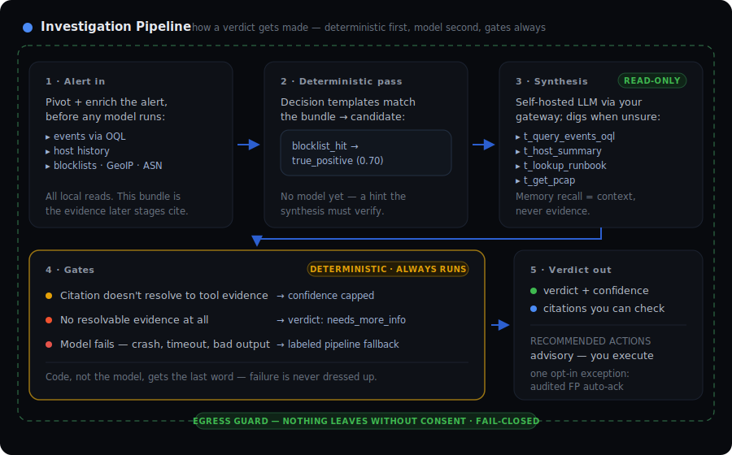

# Getting an LLM to show its work

*2026-07-10*

I built [soc-ai](https://github.com/nuk3s/soc-ai) because I wanted an LLM
triaging my Security Onion alerts and I wasn't willing to ship my network's
hostnames, usernames, and traffic to someone else's cloud to get it. That's
the whole origin story. Alert triage is the most repetitive, most
LLM-shaped job in a SOC, and it's also the job that touches the most
sensitive data you have. Every commercial offering resolves that tension in
the vendor's favor. I resolved it in mine: the model runs on my hardware, the
data stays on my network, and the code is Apache-2.0 so it can be yours too.

There was a second reason, and it's the one that shaped the architecture: an
LLM that triages alerts will sometimes be wrong, and a wrong verdict
presented confidently is worse than no verdict at all. So the real design
problem wasn't "get a model to write verdicts." It was **"make it impossible
for a verdict to look better than the evidence behind it."**

## How it works



An alert comes in and gets enriched before any model is involved: related
events pulled by query, the host's recent history, indicators checked against
local threat intel — blocklists, GeoIP, ASN. All local reads. This bundle
matters because it's the only thing later stages are allowed to cite.

Then a deterministic pass runs decision templates against the bundle. A
blocklist hit on the destination of a critical-severity alert produces a
candidate verdict with no model involved. The model's job is to verify or
overturn that hint, not to freestyle.

Synthesis is where the LLM works — a model you host, reached through your
OpenAI-compatible gateway. When it's unsure, it digs: querying events,
summarizing hosts, checking rule prevalence, looking up your runbooks,
pulling packets off the sensor. Every tool is read-only. If investigation
memory is enabled, it also sees prior verdicts and past analyst chats for
similar alerts — injected as *context, never evidence*, because an analyst's
old opinion shouldn't be citable proof of anything.

Then the gates, which are the point of the whole system. They're code, not
model, and they always run:

- A verdict that cites evidence which doesn't resolve to an actual tool
  result gets its confidence capped.
- A damning verdict with no resolvable evidence at all becomes
  `needs_more_info`.
- A model failure — crash, timeout, malformed output — produces a verdict
  **labeled as a pipeline fallback**. The UI shows a distinct chip. The
  accuracy dashboard excludes it. It is never dressed up as the model's work.

What comes out: a verdict, a confidence number, and citations you can click.
Write actions — acknowledge, escalate, comment — are recommendations you
execute. The one exception is an opt-out auto-acknowledge for
high-confidence, low-stakes false positives, and every one of those is
audited.

Around all of it sits the egress guard. By default nothing leaves your
network. If you opt into the cloud second-opinion path, everything outbound
goes through a reversible redaction tunnel, and a separate fail-closed check
inspects the sanitizer's *output* — if anything internal survived, the send
is refused. That check earned its keep last week: it refused a real prompt
because an mDNS service name had slipped past my redaction regex. The
refusal was the system working; the investigation that followed found and
fixed the regex, and the invariant is now pinned by a 640-case property
test. My own gate caught my own bug before it became a leak.

## What it runs on

My deployment: **DeepSeek-V4-Flash** (1M context) on a two-node **NVIDIA DGX
Spark** cluster, behind a **LiteLLM** gateway, against a **Security Onion
3.0** grid. But nothing in soc-ai knows or cares about that stack — it talks
to any OpenAI-compatible endpoint, so an Ollama box, a llama.cpp server, or
vLLM on a spare GPU all work. There's a model-fitness probe that tells you
up front whether the model you picked can actually do the job, because I
learned the hard way that an unfit model fails *silently* — every verdict
quietly becomes a fallback.

The app itself is one Docker container with SQLite inside. `setup.sh` checks
your Security Onion and gateway connections before it builds anything, so a
wrong password fails in seconds. On a bare Rocky Linux box, clone to healthy
container took me 43 seconds this week. `soc-ai doctor` diagnoses the whole
dependency surface in one command when something's off.

## Measured, not promised

Claims about LLM systems are cheap, so soc-ai measures itself. A nightly
micro-eval runs real alerts through the pipeline and trends verdict quality
on the dashboard — if an engine swap quietly degrades verdicts, a sparkline
bends and an alarm fires. And when the data says a feature isn't worth it, it
stays off: majority-vote self-consistency measured as pure cost (zero split
votes across 32 real alerts, +18% latency) — off. Generic runbook packs
measured as zero effect on verdicts — so instead, soc-ai distills *your own
investigation history* into draft runbooks you approve. Negative results are
results.

2,466 tests, 84% coverage, a Playwright end-to-end run in CI, and every
number in this post checked against the repo before publishing.

## Get it

```bash
git clone https://github.com/nuk3s/soc-ai.git && cd soc-ai
./setup.sh
```

Free, Apache-2.0, no meter, no phone-home:
[github.com/nuk3s/soc-ai](https://github.com/nuk3s/soc-ai). If you run
Security Onion, it will triage your queue with a model you own — and when it
can't defend a verdict, it will tell you that too.
