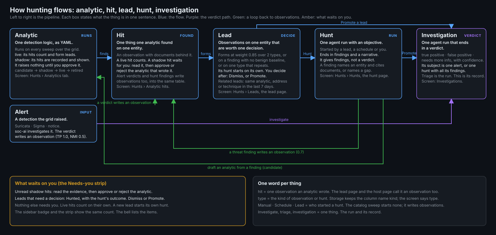
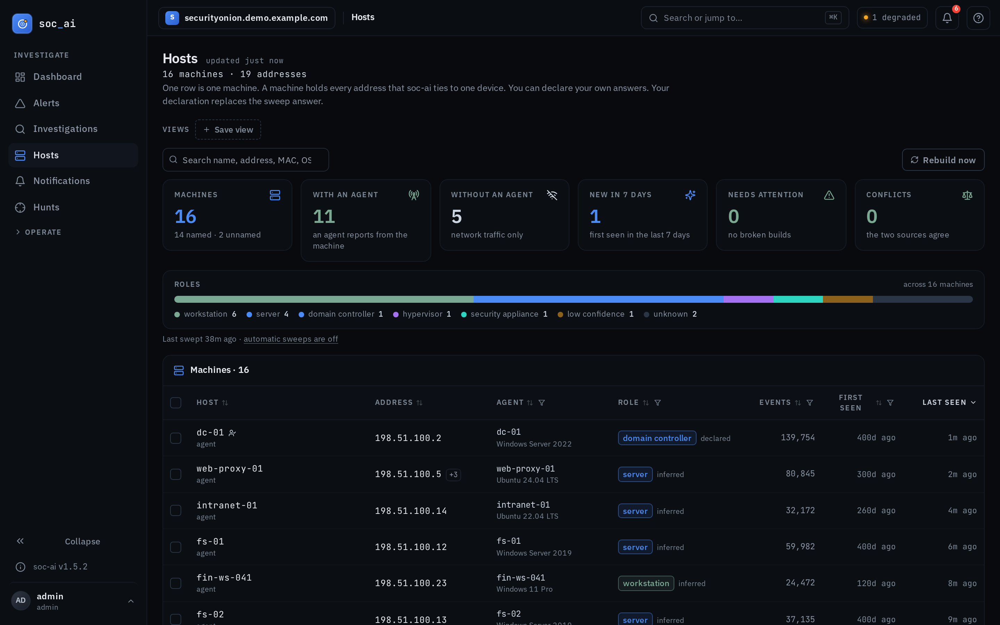
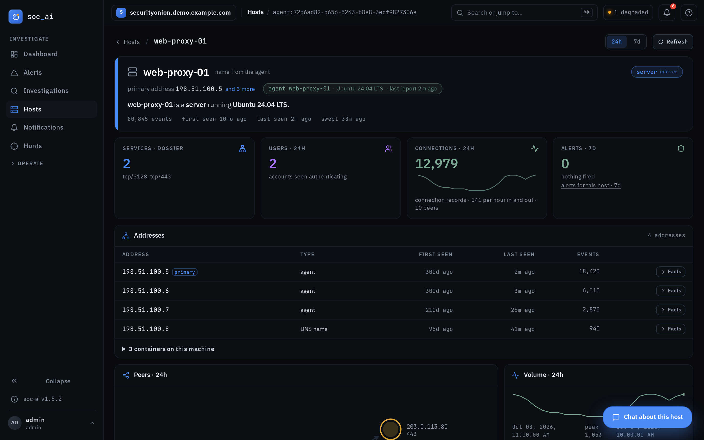

# soc-ai hunts on its own now

*2026-10-04*

soc-ai hunts on its own now. That's the biggest change since the [last post](2026-07-getting-an-llm-to-show-its-work.md) in July, at 1.2.0. The clearest case for it came from my range in early September, where a Kerberoast and then a DCSync from a workstation account didn't raise a single Security Onion alert. Back then soc-ai only looked at alerts, so it didn't see anything either.

Since 1.5.0, soc-ai runs its own detection logic over your grid on a schedule, and when enough hits pile up on one machine it opens a lead and starts a hunt there, without waiting for an alert or for you. The rule from the July post still holds: a verdict can't look better than the evidence behind it. A hunt lives under that rule too, and this post is mostly about what that looks like in the product.

## How a hunt starts

Each piece of that detection logic is an analytic, a short YAML file that compiles to one Elasticsearch query. No model touches it, so when one fires you can open the file and see exactly why. Seven are plain queries. Four of those are DCSync from a non-machine account (event 4662), Kerberoasting with RC4 tickets (4769), AS-REP roasting against accounts with preauth disabled (4768), and anything that touches an OpenCanary decoy. The other three read Windows events on servers and domain controllers, for Defender detections (1116 and 1117), audit policy changes (4719) and adds to privileged groups (4728, 4732 and 4756).

Nine more analytics are profiles, and each one compares a machine with its own baseline: the ports it serves, the users who log on, its process names, its connection rate, the DNS names it looks up, and a few more. That's how you'd catch a server that starts listening on a port it's never served before. A profile needs about a week of quiet data before it scores anything, and until then the analytic says it's learning. It doesn't call the host calm.

Take the September chain from the range. The Kerberoast left an event 4769 on the domain controller and the DCSync left a 4662, and both analytics fired on them. Each hit became an observation on what it named. Observations decay over about 48 hours and they stack, so one odd event fades out while a few on the same machine add up past a threshold. These formed a lead on the domain controller that cites both the 4662 and the 4769.

Every lead starts its own hunt. You read what the hunt found and promote the finding you believe, and that becomes an investigation that ends in a verdict with its evidence attached. On the Hunts page all of that reads left to right, and a "Needs you" strip lists whatever is waiting on you. Every analytic has a status: candidate, shadow, live or retired. It also has a ledger of what it produced: the observations it wrote, the leads it fed, and how those leads ended. You approve a shadow analytic to live once you've watched it for a while, and you retire one with a reason.



## What a hunt can't do to a lead

A hunt that answers "clean" closes its lead, since that's the whole point of hunting a lead automatically. But a hunt can only close a lead if it read its evidence. If the grid was stalled and the hunt's own finding says "Alert documents unreadable due to grid timeout", the lead stays open under "Needs you" with that reason showing. And once an earlier hunt on that lead found a threat, no later hunt can close it, no matter how clean the later one looks. I added both rules after watching a stalled re-hunt close a lead that had two critical findings sitting right on it. That's the exact false all-clear I built soc-ai to avoid.

Every decision on a lead now stays on the lead. Dismiss with a reason, reopen, promote, hold, closed by a hunt: the page lists them in order, with the hunt or the investigation each one links to. Reopening a lead clears its old dismissal, so an open lead never carries a stale reason.

## Drafting a detection from a finding

"Draft an analytic" is a button on a hunt finding. It turns the finding into a candidate analytic that you can run in shadow and then approve. The first version of it wrote the case. A finding about one host polling two dead domains became an analytic that matched that host and those two names, so it would only ever fire on the case it came from. I saw it and said "the proposed analytic was very specific." Analytics are supposed to generalize.

So the drafter now describes the behavior. It keeps exact values only where they're stable, like event codes, datasets and response codes, and it won't take a clause pinned to one host, user, domain or path. A deterministic check reads every clause before you see the draft, and the model gets one retry with the pins named. If the draft still comes out that specific, the dialog says "specific to one case" before you save it. The dry run also tells you how many distinct hosts the clause matched in the window, so "1 host matched in 30 days" is your cue that the draft is still too narrow.

## The Hosts page is one row per machine

From August 7, when the host dossier shipped, the Hosts page showed one row per IP address. My proxy box has 14 addresses, so it got 14 rows. One VM with five network cards got ten, and none of them had a name. On production that came to 205 rows for about 144 machines. On October 2 I wrote this about it:

> I am not convinced that the search works. The columns cannot be filtered or sorted. There is clearly an issue with hosts with multiple nics being displayed multiple times.

All three were right. Two agent hosts couldn't even be found by search. Their one-word hostnames are also public top-level domains, and there are about 1,400 of those. The name filter I'd written to throw out junk like a bare "com" was throwing out each agent's own report of its name.

It's one row per machine now. Addresses group by agent identity first, then by a container bridge that agent owns, then by DHCP lease MAC, then by a name only one machine has, and each machine gets a stable key. Every column sorts both ways, and Role, Agent, Activity and First seen have filters in the header. One search box finds names, addresses, MACs, OS, role and agent name, and it searches every machine whether or not the list is filtered. An address matches exactly first, then by prefix. Back takes you to the page and scroll position you left, because the list state lives in the URL. Each card above the list is a link to the filter it counts.



If you've got a box with several network cards, it gets one row, and its own page lists every address with its type, plus any containers running on it. One container host on my network shows 7 addresses and 30 containers there. Old links by address still work: they resolve to the machine page with that address in focus. Production shows 182 machines across 222 addresses today, 13 of them agent hosts, and every one of them can be found by name.



## Knowing what a host ships

On September 20 a triage said one Linux host had no host telemetry. That host runs Elastic Agent with filebeat and osquerybeat, and it ships about 75,000 documents a day. Since August 17, twelve investigations and hunts had made that same claim about it. Every one of them asked for Elastic Defend datasets, `endpoint.events.process` and `endpoint.events.network`, which that host has never shipped. If your hosts run Elastic Agent without Elastic Defend, you'd have hit this too. Nothing in soc-ai told the model which datasets a host ships, so it asked the wrong question, got zero, and wrote the wrong sentence.

Now soc-ai counts what kinds of data a machine ships, with numbers: host logs, process events, endpoint network, Windows security, osquery and the agent's own logs. The host dossier tool and the alert prefetch both carry that count, so the model sees "this host ships host logs and osquery, and no process events" before it writes anything. If a hunt writes "No host telemetry on X" anyway, the hunt gate rewrites it to "No process or endpoint network telemetry on X". In reports, a grounding check does the same. The profile baselines read what Linux agents ship too, so logon users and DNS names now measure on a host that has no Windows security log.

## Checking its own work

1.4.0 added an eval that plants an attack, runs the hunt, promotes the finding, reads the verdict and scores each step, so you can see which step broke. Every synthetic run is marked as synthetic wherever you'd see it. I also ran the same eval batch twice on code that couldn't have changed a verdict, and six of 25 scenarios flipped between pass and fail. That's the noise floor, and it's why the eval never moves a threshold on one batch.

The audit chain check now reads the newest seven days first, a page at a time, and it tells duplicate sequence numbers apart from an altered record. Two writers at once leave duplicates. `soc-ai doctor` and the preflight both carry an audit-chain row. And model text gets a secret scrub before soc-ai stores it, so a password the model read out of a file in the telemetry never lands in a report.

## Turning on TLS

1.5.2 puts Caddy in front of soc-ai with one command:

```bash
scripts/tls-proxy.sh enable <domain> [auto|internal|<cert.pem> <key.pem>]
```

Caddy runs as a compose profile and handles the renewals for you, from Let's Encrypt, from its own CA, or from a certificate you bring. If you run soc-ai without the proxy, it validates your certificate, shows it in Config and in the doctor, and warns you 30, 14 and 7 days before it expires.

Unreleased on main, there's a fourth form, `acme <directory-url> <root.pem>`, for a private ACME CA. My lab issues its certificates from its own Caddy, and since production chained to it on Friday, October 2, Caddy has renewed that certificate six times, every eight hours on 12-hour leaves, without me touching it.

The release notes for [1.5.0](../releases/1.5.0.md), [1.5.1](../releases/1.5.1.md) and [1.5.2](../releases/1.5.2.md) have the rest, and the code is where it always was: [github.com/nuk3s/soc-ai](https://github.com/nuk3s/soc-ai).
