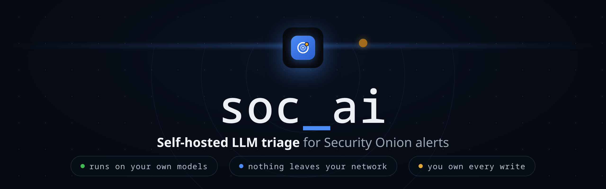
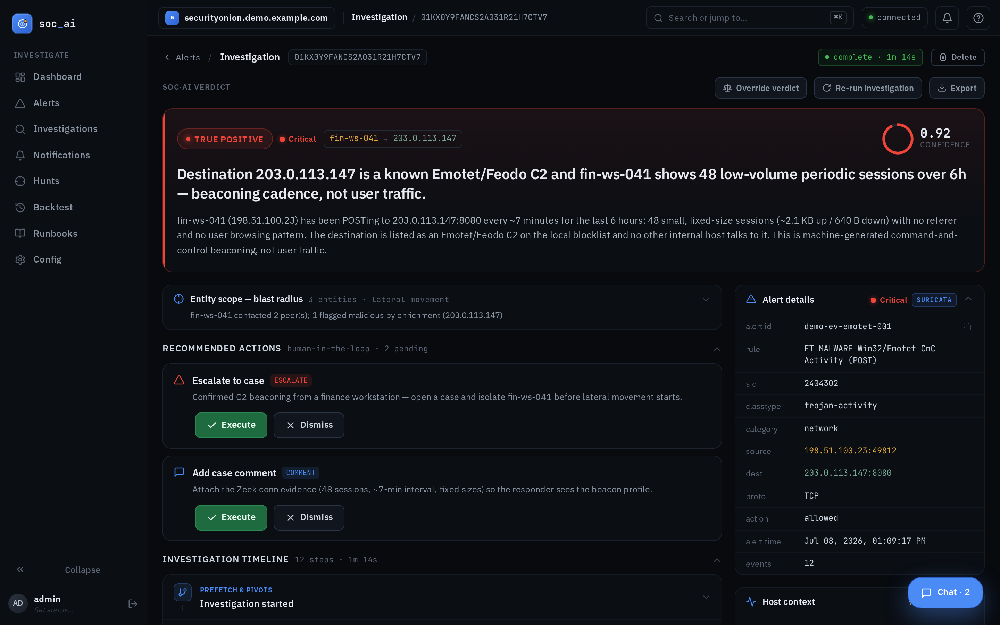
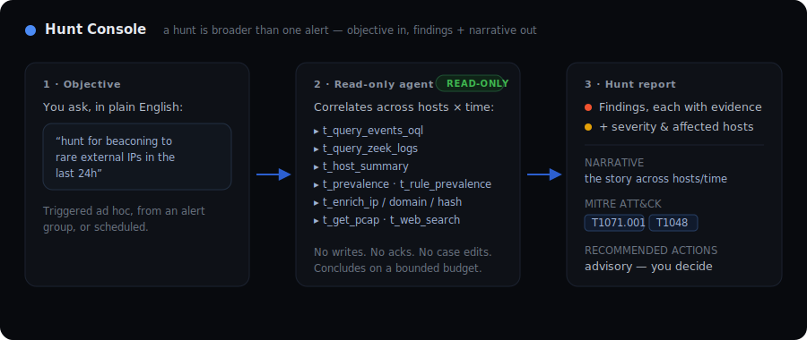
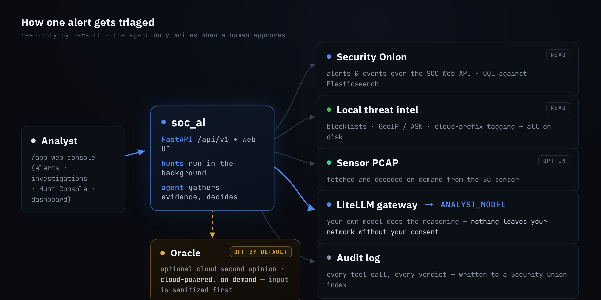

# soc-ai

  

**Onion AI without the Pro license.** soc-ai reads the alerts on your
[Security Onion](https://securityonionsolutions.com/) grid and triages them with an
LLM you host yourself. For each alert it pulls the related events, checks what else the
host has been doing, runs the indicators against local threat intel, and decodes the
packets off the sensor when that's what it takes. Then it hands you a **verdict, a
confidence number, and the reasoning that got it there.**

The model runs on your own hardware behind a [LiteLLM](https://docs.litellm.ai/) gateway.
Nothing about your network leaves it, and write-backs stay yours: the agent recommends,
you execute. The one exception is an audited auto-acknowledge for high-confidence,
low-stakes false positives, on by default and one toggle to turn off. There's an optional cloud "Oracle" for a second opinion
on the hard ones; it's off until you turn it on, and its input is sanitized first.

!!! note
    Not affiliated with or endorsed by Security Onion Solutions, LLC. soc-ai is a
    separate service that talks to a grid you already run.

  

---

## The web console

-   :material-monitor-dashboard: **A web console**

    ---

    A console at `/app` shows your alert queue grouped by rule, with the AI verdict and
    confidence inline next to each one. Open an alert to investigate it, or sweep the whole
    untriaged queue with auto-triage. Every investigation gets a shareable permalink.

    [:octicons-arrow-right-24: Web console guide](WEBUI_GUIDE.md)

Under the hood it runs a read-only agent. For one alert it will:

- read the alert context, the related events (via [OQL](OQL_PRIMER.md)), and the host's
  recent alert history;
- enrich the indicators against on-disk threat intel: blocklists, GeoIP/ASN,
  cloud-prefix tagging;
- pull and decode raw PCAP from the sensor when the payload matters;
- weigh the evidence and write a verdict with its confidence and rationale;
- recommend the write actions (acknowledge, escalate to a case, comment) for you to run
  with one click.

See [what the agent can do](AGENT_TOOLS.md) for the full tool surface and its guardrails.

---

## Hunt across the estate, not just one alert

Some questions are bigger than a single detection: *"is anything beaconing to a rare
external IP?"*, *"are the DCs seeing credential-abuse lockouts?"*, *"APT-X uses technique
Y; is it showing up here?"* The **Hunt Console** takes an objective in plain English and turns
the same read-only agent loose across many hosts and a time window, then hands back
**findings + a narrative** mapped to MITRE ATT&CK, rather than a single-alert verdict.

  

Hunts follow the **same safety model** as investigation: strictly read-only. The agent
queries and correlates; it never acks, escalates, or edits a case. It runs on a bounded
budget and concludes with what it found, and if it's cut short it still writes up a
grounded partial report rather than erroring out.

---

## What it won't do on its own

The whole point is that you stay in control of anything that changes state.

- **Reads run freely:** pulling events, context, enrichment, and packets is safe, so the
  agent does it without asking.
- **Writes wait for a human:** acknowledging an alert, opening a case, leaving a comment.
  The agent recommends them and you execute them with a click. One pragmatic carve-out
  ships on by default: **confident false positives are auto-acknowledged** (confidence-
  gated, never on critical/high-severity or malware/exploit-class alerts, every
  unattended write audited). `auto_ack_fp_enabled=false` turns it off.
- **Nothing leaves your network without your consent.** The reasoning runs on your own
  model, on your own hardware. The Oracle (an optional cloud second opinion) is **off by
  default**, and even when on, internal hostnames, usernames, and IPs are redacted before
  anything is sent. Leave it off and the whole pipeline stays on your network.

[:octicons-arrow-right-24: The full safety model](SAFETY_MODEL.md)

---

## Why run your own

Alert triage is the one place a SOC most wants to point an LLM, and the one place you
least want to ship your network's hostnames, usernames, and IPs to someone else's cloud.
soc-ai exists so you don't have to make that trade:

- **Free and yours:** no per-seat, per-alert, or per-investigation meter, and no license
  unlocked by phoning home. You run it, you own it.
- **Fully local, or air-gapped:** the reasoning runs on a model you host. With the Oracle
  off (the default), the whole pipeline works with no internet at all.
- **Readable reasoning:** every verdict cites the events it rests on, and no
  true/false-positive call stands without evidence from a tool call.
- **You own every change:** the agent recommends writes and you execute them; the one
  unattended write (the FP auto-ack) is bounded, audited, and yours to switch off.

---

## How it works

  

`ANALYST_MODEL` is the one model the agent triages with: whatever your gateway serves.
The reasoning happens locally. The Oracle path is the only way anything reaches a cloud
API, it's opt-in, and it only ever sees sanitized input.

[:octicons-arrow-right-24: Architecture in depth](ARCHITECTURE.md)

---

## Get started

-   :material-rocket-launch: **Quickstart**

    ---

    Clone, run `./setup.sh`, and work your first alert in the browser.

    [:octicons-arrow-right-24: Quickstart](quickstart.md)

-   :material-shield-check: **Security Onion setup**

    ---

    The SO account, role, and firewall prerequisites: the setup steps that reliably bite.

    [:octicons-arrow-right-24: SO setup](SECURITY-ONION-SETUP.md)

-   :material-docker: **Docker deployment**

    ---

    Required mounts, SELinux relabeling, upstream TLS trust, and the port-8443 conflict.

    [:octicons-arrow-right-24: Docker](DOCKER.md)

---

soc-ai is open source under the [Apache-2.0 license](https://github.com/nuk3s/soc-ai/blob/main/LICENSE).
If you already run Security Onion, it's the self-hosted way to put a local model to work on
your queue. Curious where the project is going? The [roadmap](ROADMAP.md) keeps the
story honest, including everything already shipped behind a switch.
