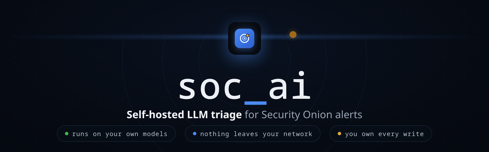
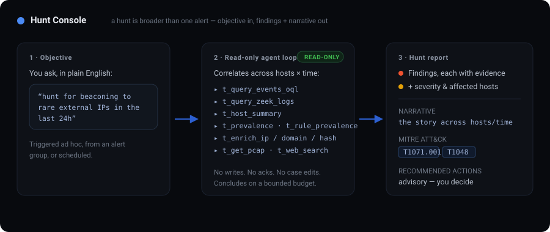
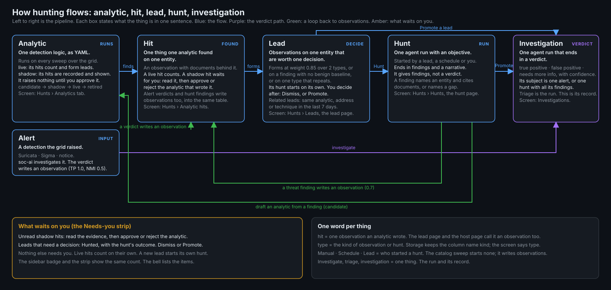
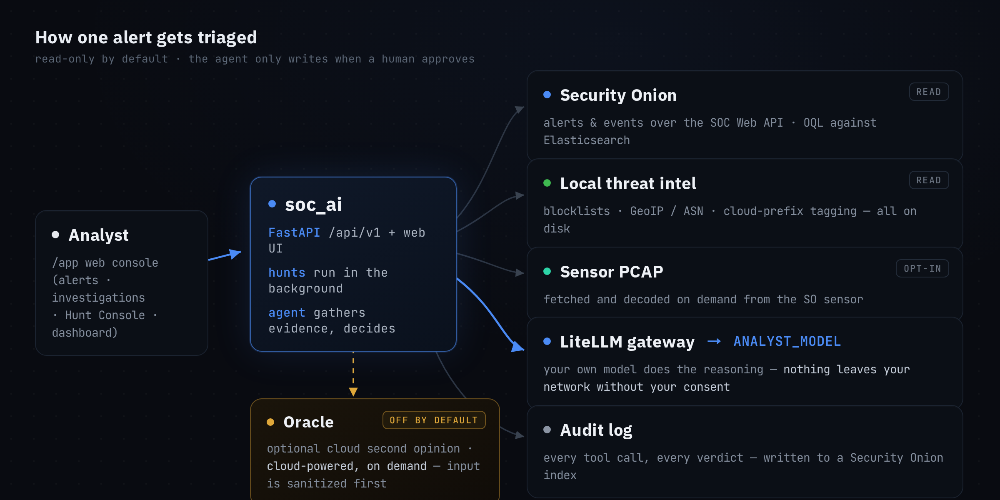

# soc-ai

  

**Onion AI without the Pro license.** soc-ai reads the alerts on your
[Security Onion](https://securityonionsolutions.com/) grid. It triages them with
a large language model that you host yourself. For each alert it pulls the
related events, and it checks what else the host has done. It runs the
indicators against local threat intel. It decodes the packets from the sensor if
the payload matters. Then it gives you a verdict, a confidence number, and the
reasoning behind them.

The model runs on your own hardware behind a [LiteLLM](https://docs.litellm.ai/) gateway.
No data about your network leaves it. The write-backs stay yours, because the
agent recommends and you execute. One exception exists. soc-ai can
auto-acknowledge a high-confidence, low-stakes, investigated false positive, and
it audits that write. The exception is off until you turn it on.

An optional cloud Oracle gives a second opinion on a hard alert. The Oracle is
off until you turn it on, and soc-ai sanitizes its input first.

!!! note
    Security Onion Solutions, LLC has no affiliation with soc-ai and does not
    endorse it. soc-ai is a separate service. It reads a grid that you already
    run.

  

---

## The web console

-   :material-monitor-dashboard: **A web console**

    ---

    A console at `/app` shows your alert queue grouped by rule. Each row carries
    the verdict and the confidence. Open an alert to investigate it. Use
    auto-triage to sweep the whole untriaged queue. Every investigation has a
    permalink that you can share.

    The dashboard carries an assistant that answers questions about your grid in
    one turn. It uses the same read-only tools. Ask it which datasets you have,
    or which rule was noisiest overnight. If a question needs a sweep, the
    assistant writes the hunt objective and waits for you to confirm it.

    [:octicons-arrow-right-24: Web console guide](WEBUI_GUIDE.md)

soc-ai runs a read-only agent. For one alert it does this:

1. It reads the alert context, the related events and the recent alert history
   of the host. It queries the events with [OQL](OQL_PRIMER.md).
2. It enriches the indicators against on-disk threat intel: blocklists, GeoIP
   and ASN data, and cloud-prefix tagging.
3. It pulls and decodes raw PCAP from the sensor if the payload matters.
4. It weighs the evidence and writes a verdict with a confidence and a
   rationale.
5. It recommends the write actions for you to run with one click: acknowledge,
   escalate to a case, and comment.

See [what the agent can do](AGENT_TOOLS.md) for the full tool surface and its guardrails.

---

## Hunting across the network

Some questions cover more than one detection. *"Is anything beaconing to a rare
external IP?"* *"Are the domain controllers seeing credential-abuse lockouts?"*
*"APT-X uses technique Y. Does it appear here?"* The **Hunt Console** takes an
objective in plain English. It runs the same read-only agent across many hosts
and a time window. It returns findings and a narrative mapped to MITRE ATT&CK.

  

A hunt follows the same safety model as an investigation. A hunt is read-only.
The agent queries and correlates. It never acknowledges an alert, escalates one,
or edits a case. It runs on a bounded budget and reports what it found. If the
budget stops it early, it still writes a grounded partial report instead of an
error.

soc-ai also hunts when nobody asks. An analytic runs over the grid and writes a
hit. Hits on one entity form a lead. The lead starts its own hunt, and you
promote the hunt to an investigation that ends in a verdict.

  

[:octicons-arrow-right-24: The hunting guide](HUNTING.md)

---

## What soc-ai does not do on its own

You stay in control of every action that changes state.

- **Reads run freely.** The agent pulls events, context, enrichment and packets
  without asking. A read changes nothing.
- **Writes wait for a human.** A write acknowledges an alert, opens a case or
  adds a comment. The agent recommends the write and you execute it with a
  click. One exception is off until you turn it on with
  `auto_ack_fp_enabled=true`. It auto-acknowledges a confident false positive.
  The investigation must have retrieved something first. It never fires on a
  critical or high-severity alert, or on a malware-class or exploit-class alert,
  and soc-ai audits every unattended write.
- **No data leaves your network without your consent.** The reasoning runs on
  your own model and your own hardware. The Oracle is an optional cloud second
  opinion, and it is off by default. If you turn it on, soc-ai redacts
  internal hostnames, usernames and IP addresses before it sends anything. Leave
  it off and the whole pipeline stays on your network.

[:octicons-arrow-right-24: The full safety model](SAFETY_MODEL.md)

---

## Why run your own

Alert triage is the task a security operations centre most wants to give to an
LLM. It is also the task where you least want to send your hostnames, usernames
and IP addresses to another company's cloud. soc-ai removes that trade:

- **Free and yours:** soc-ai has no per-seat meter, no per-alert meter and no
  per-investigation meter. No license needs a call home. You run it and you own
  it.
- **Local or air-gapped:** the reasoning runs on a model that you host. The
  Oracle is off by default, so the whole pipeline works with no internet
  connection.
- **Readable reasoning:** every verdict cites the events that it rests on. A
  true-positive or false-positive verdict needs evidence from a tool call.
- **You own every change.** The agent recommends a write and you execute it. The
  false-positive auto-acknowledge is the one unattended write. It is off by
  default, bounded and audited. It never fires if the run retrieved nothing.

---

## How it works

  

`ANALYST_MODEL` names the one model that the agent triages with. It is whatever
model your gateway serves. The reasoning runs on your host. The Oracle path is
the only path that reaches a cloud API. You opt in to the Oracle, and it reads
sanitized input only.

[:octicons-arrow-right-24: Architecture in depth](ARCHITECTURE.md)

---

## Get started

-   :material-rocket-launch: **Quickstart**

    ---

    Clone the repo, run `./setup.sh`, and work your first alert in the browser.

    [:octicons-arrow-right-24: Quickstart](quickstart.md)

-   :material-shield-check: **Security Onion setup**

    ---

    The Security Onion account, role and firewall prerequisites. These setup steps reliably cause trouble.

    [:octicons-arrow-right-24: SO setup](SECURITY-ONION-SETUP.md)

-   :material-docker: **Docker deployment**

    ---

    The required mounts, SELinux relabeling, upstream TLS trust, and the port 8443 conflict.

    [:octicons-arrow-right-24: Docker](DOCKER.md)

---

soc-ai is open source under the [Apache-2.0 license](https://github.com/nuk3s/soc-ai/blob/main/LICENSE).
If you already run Security Onion, soc-ai puts a local model to work on your
alert queue. The [roadmap](ROADMAP.md) keeps the story honest, and it includes
everything that already shipped behind a switch.
